# 无人机控制理论专题 — 从经典PID到前沿自适应控制

> **项目状态**：持续更新中 | **最后更新**：2026-05-11 | **文档语言**：中文为主，技术术语保留英文

---

## 项目简介

本项目是一套面向**无人机飞控自动化方向学生**的系统性控制理论学习资料。内容从经典 PID 控制出发，逐步覆盖现代控制、非线性控制、自适应与智能控制，最终落脚到 Simulink 仿真验证和前沿论文导读。

**核心理念**：理论推导 + 工程直觉 + 仿真验证，三位一体。

---

## 目标读者

| 读者类型 | 适合程度 | 说明 |
|---------|---------|------|
| 飞控方向本科生 | ★★★★★ | 课程设计、毕业设计的核心参考 |
| 控制理论研究生 | ★★★★☆ | 快速建立 UAV 控制知识框架 |
| 飞控工程师 | ★★★★☆ | 系统回顾 + 前沿方法速查 |
| 自学爱好者 | ★★★☆☆ | 需具备一定数学和控制基础 |

---

## 前置知识要求

```
数学基础
├── 线性代数（矩阵运算、特征值、SVD）
├── 微积分（多元函数、常微分方程）
├── 复变函数（拉普拉斯变换、频域分析基础）
└── 概率统计（基础即可）

控制基础
├── 自动控制原理（传递函数、方框图、稳定性）
├── 信号与系统（频域分析、采样定理）
└── MATLAB/Simulink 基本操作

力学基础
└── 理论力学（刚体运动、欧拉角、四元数）
```

---

## 学习路线总览

```mermaid
graph TD
    A[00-导读与学习路线] --> B[01-经典控制基础]
    A --> C[02-现代控制方法]
    A --> D[03-非线性控制]
    A --> E[04-自适应与智能控制]
    A --> F[05-Simulink仿真验证]
    A --> G[06-论文导读与前沿]

    B --> B1[PID控制原理与调参]
    B --> B2[频域分析与设计]
    B --> B3[状态空间控制]
    B --> B4[鲁棒控制基础]
    B --> B5[多回路与级联控制]

    C --> C1[自抗扰控制ADRC]
    C --> C2[模型参考自适应MRAC]
    C --> C3[模型预测控制深入]
    C --> C4[增益调度控制]
    C --> C5[最优控制与动态规划]

    D --> D1[反步法Backstepping]
    D --> D2[滑模控制深入]
    D --> D3[动态面控制DSC]
    D --> D4[几何控制与SE3]
    D --> D5[非线性观测器]

    E --> E1[神经网络自适应控制]
    E --> E2[模糊控制与自适应模糊]
    E --> E3[强化学习控制策略]
    E --> E4[混合智能控制]

    F --> F1[控制器Simulink实现模式]
    F --> F2[线性化与控制器设计工具]
    F --> F3[蒙特卡洛仿真与鲁棒性验证]

    G --> G1[经典控制论文]
    G --> G2[先进控制论文]
    G --> G3[智能控制前沿论文]
```



---

## 六大模块详解

| 模块 | 目录 | 文件数 | 核心内容 | 建议学时 |
|-----|------|--------|---------|---------|
| 01-经典控制基础 | `docs/01-经典控制基础/` | 5 | PID、频域、状态空间、鲁棒控制、级联控制 | 40h |
| 02-现代控制方法 | `docs/02-现代控制方法/` | 5 | ADRC、MRAC、MPC、增益调度、最优控制 | 45h |
| 03-非线性控制 | `docs/03-非线性控制/` | 5 | Backstepping、SMC、DSC、几何控制、观测器 | 50h |
| 04-自适应与智能控制 | `docs/04-自适应与智能控制/` | 4 | 神经网络、模糊控制、强化学习、混合方法 | 40h |
| 05-Simulink仿真验证 | `docs/05-Simulink仿真验证/` | 3 | 实现模式、线性化工具、蒙特卡洛验证 | 25h |
| 06-论文导读与前沿 | `docs/06-论文导读与前沿/` | 3 | 30+ 论文精读卡片 | 30h |

---

## 文档规范

所有技术文档遵循统一格式：

```markdown
# 标题
> 预计阅读：X 分钟 | 前置知识：xxx

---

## 1. 概述
## 2. 理论推导
## 3. 工程实现
## 4. 仿真实验
## 5. 小结

---

## 思考题
1. ...
2. ...
3. ...

<details>
<summary>参考答案</summary>
...
</details>
```

**格式要素**：
- Mermaid 流程图 / 状态图 / 框图
- ASCII 艺术展示系统结构
- LaTeX 数学公式（行内 `$...$`，独立 `$$...$$`）
- 表格对比不同方法
- 代码块展示 MATLAB/Python 实现

---

## 所需工具箱

| 工具箱 | 用途 | 必要性 |
|-------|------|--------|
| Simulink Control Design | 线性化、PID 调参、频率响应估计 | 必需 |
| Robust Control Toolbox | H-infinity、mu-synthesis、鲁棒分析 | 推荐 |
| Model Predictive Control Toolbox | MPC 控制器设计与仿真 | 推荐 |
| Reinforcement Learning Toolbox | RL 控制策略训练 | 可选 |
| Robotics System Toolbox | 坐标变换、四元数运算 | 推荐 |
| Symbolic Math Toolbox | 符号推导辅助 | 可选 |

**最低配置**：MATLAB R2023b + Simulink + Simulink Control Design

---

## 参考资源

### 教材

| 书名 | 作者 | 适用模块 |
|------|------|---------|
| 《自动控制原理》(第7版) | 胡寿松 | 模块01 |
| 《Modern Control Engineering》(5th) | Katsuhiko Ogata | 模块01-02 |
| 《非线性系统》(第3版) | Hassan K. Khalil | 模块03 |
| 《Robust and Optimal Control》 | Zhou, Doyle, Glover | 模块01-02 |
| 《Applied Nonlinear Control》 | Slotine, Li | 模块03 |
| 《Model Predictive Control》 | Camacho, Bordons | 模块02 |
| 《Reinforcement Learning: An Introduction》 | Sutton, Barto | 模块04 |
| 《无人机系统导论》 | 张明廉 等 | 全局背景 |

### 重要论文

详见 [`references/paper-list.md`](references/paper-list.md)，收录 30+ 篇经典与前沿论文。

### GitHub 仓库

| 仓库 | 说明 | 链接 |
|------|------|------|
| PX4-Autopilot | 开源飞控固件 | https://github.com/PX4/PX4-Autopilot |
| ArduPilot | 开源飞控平台 | https://github.com/ArduPilot/ardupilot |
| Awesome-UAV | UAV 资源汇总 | https://github.com/liguge/Awesome-UAV |
| control-toolbox | 控制工具箱 | https://github.com/ethz-adrl/control-toolbox |
| casadi | 非线性优化 | https://github.com/casadi/casadi |
| do-mpc | MPC 框架 | https://github.com/do-mpc/do-mpc |

详见 [`references/repo-annotations.md`](references/repo-annotations.md)。

---

## 思维导图

项目提供四张思维导图，帮助快速建立知识框架：

| 文件 | 内容 |
|------|------|
| [control-theory-tree.md](mindmaps/control-theory-tree.md) | 控制方法全景树 |
| [pid-tuning-guide.md](mindmaps/pid-tuning-guide.md) | PID 调参决策流程 |
| [nonlinear-control-map.md](mindmaps/nonlinear-control-map.md) | 非线性控制方法对比 |
| [algorithm-selection.md](mindmaps/algorithm-selection.md) | 算法选择指南 |

---

## 如何使用本项目

```
推荐学习顺序：

第1周  ──→  00-导读（建立全局视图）
第2-3周 ──→  01-经典控制基础（夯实基础）
第4-6周 ──→  02-现代控制方法（拓展视野）
第7-9周 ──→  03-非线性控制（深入核心）
第10-11周──→  04-自适应与智能控制（前沿探索）
第12周  ──→  05-Simulink仿真（动手验证）
持续    ──→  06-论文导读（跟踪前沿）
```

**学习建议**：
1. 每篇文档先通读理论部分，建立概念框架
2. 重点关注工程实现和 MATLAB 代码示例
3. 完成每篇末尾的思考题，检验理解程度
4. 结合 Simulink 仿真验证理论推导
5. 定期回顾思维导图，强化知识关联

---

## 相关项目

本项目是 [Qxy661](https://github.com/Qxy661) 无人机教学文档系列之一：

| 项目 | 说明 | GitHub |
|------|------|--------|
| Simulink-UAV-Dynamics-Sim | Simulink无人机动力学仿真+PX4对接 | [Qxy661/Simulink-UAV-Dynamics-Sim](https://github.com/Qxy661/Simulink-UAV-Dynamics-Sim) |
| RL-Autonomous-Flight | 强化学习自主飞行 | [Qxy661/RL-Autonomous-Flight](https://github.com/Qxy661/RL-Autonomous-Flight) |
| UAV-Comm-DataLink | 无人机通信与数据链 | [Qxy661/UAV-Comm-DataLink](https://github.com/Qxy661/UAV-Comm-DataLink) |
| LLM-Driven-UAV | LLM驱动的无人机系统 | [Qxy661/LLM-Driven-UAV](https://github.com/Qxy661/LLM-Driven-UAV) |

## 贡献指南

欢迎提交 Issue 和 Pull Request！详见 [CONTRIBUTING.md](CONTRIBUTING.md)。

---

## 许可证

本项目采用 [CC BY-NC-SA 4.0](https://creativecommons.org/licenses/by-nc-sa/4.0/) 许可协议。

---

## 联系方式

- Issues：欢迎在 GitHub 提交问题和建议
- Discussions：欢迎参与讨论区交流

---

> **致谢**：感谢所有开源飞控社区的贡献者，以及各位控制理论前辈的学术成果。
