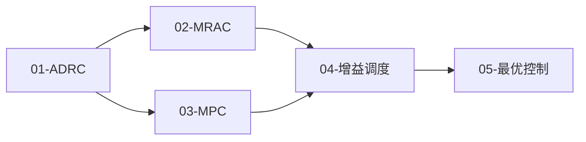
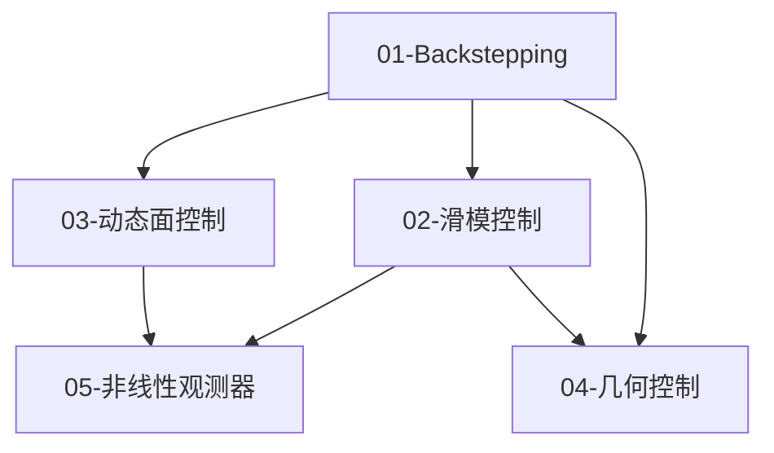
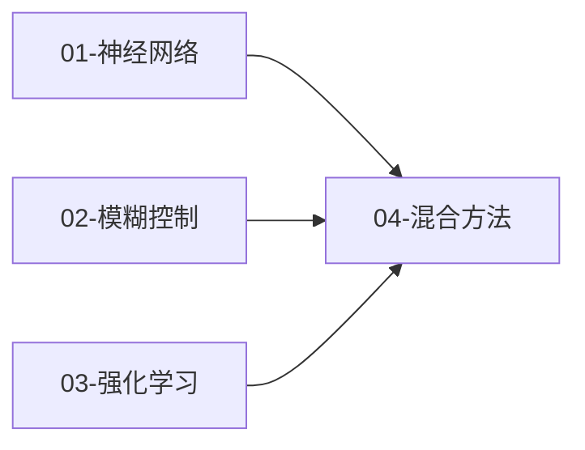

# 00 - 导读与学习路线

> 预计阅读：15 分钟 | 前置知识：无

---

## 1. 为什么学习无人机控制理论？

无人机（UAV）控制是控制理论最活跃的应用领域之一。从消费级航拍无人机到工业级物流无人机，再到军用侦察无人机，**飞控系统**始终是核心。

```
┌─────────────────────────────────────────────────┐
│                  无人机系统架构                    │
├─────────────────────────────────────────────────┤
│                                                 │
│   ┌──────────┐    ┌──────────┐    ┌──────────┐ │
│   │  传感器  │───→│  飞控算法 │───→│  执行器  │ │
│   │ IMU/GPS  │    │  控制器  │    │ 电调/电机│ │
│   └──────────┘    └──────────┘    └──────────┘ │
│        ↑               │               │       │
│        │               ↓               ↓       │
│   ┌──────────┐    ┌──────────┐    ┌──────────┐ │
│   │  环境感知 │    │  状态估计 │    │  动力学  │ │
│   │ 避障/规划 │    │ 卡尔曼滤波│    │  模型   │ │
│   └──────────┘    └──────────┘    └──────────┘ │
│                                                 │
└─────────────────────────────────────────────────┘
```

**控制理论在 UAV 中的核心地位**：

| 层级 | 功能 | 控制方法 |
|------|------|---------|
| 底层 | 姿态稳定（角度/角速率控制） | PID、级联控制 |
| 中层 | 位置跟踪（轨迹跟踪） | LQR、ADRC、MPC |
| 高层 | 路径规划与决策 | 最优控制、RL |
| 全局 | 故障容错与自适应 | MRAC、NN自适应 |

---

## 2. 学习路线总览

### 2.1 知识体系全景

```mermaid
mindmap
  root((UAV控制理论))
    经典控制基础
      PID控制
        P/I/D项
        调参方法
        抗积分饱和
      频域分析
        Bode图
        Nyquist判据
        稳定裕度
      状态空间
        能控性/能观性
        极点配置
        LQR/LQG
      鲁棒控制
        H-infinity
        mu综合
      级联控制
        内外环设计
        带宽分离
    现代控制方法
      ADRC
        ESO
        TD
        NLSEF
      MRAC
        MIT规则
        Lyapunov方法
      MPC
        滚动时域
        约束处理
      增益调度
        LPV模型
        插值方法
      最优控制
        Pontryagin
        HJB方程
    非线性控制
      Backstepping
        递归设计
        虚拟控制
      滑模控制
        滑模面设计
        超螺旋算法
      DSC
        滤波器设计
      几何控制
        SE(3)控制
        四元数方法
      非线性观测器
        扩展观测器
        高增益观测器
    自适应与智能控制
      神经网络
        RBF网络
        在线学习
      模糊控制
        模糊推理
        自适应模糊
      强化学习
        策略梯度
        Actor-Critic
      混合方法
        NN+SMC
        RL+MPC
    Simulink仿真
      实现模式
      线性化工具
      蒙特卡洛验证
    论文导读
      经典论文
      先进控制
      前沿方向
```

**各主题对应文档索引**：

| 主题 | 文档链接 |
|------|---------|
| PID控制 | [01-PID控制原理与调参](./01-经典控制基础/01-PID控制原理与调参.md) |
| 频域分析 | [02-频域分析与设计](./01-经典控制基础/02-频域分析与设计.md) |
| 状态空间 | [03-状态空间控制基础](./01-经典控制基础/03-状态空间控制基础.md) |
| 鲁棒控制 | [04-鲁棒控制基础](./01-经典控制基础/04-鲁棒控制基础.md) |
| 级联控制 | [05-多回路与级联控制](./01-经典控制基础/05-多回路与级联控制.md) |
| ADRC | [01-自抗扰控制ADRC](./02-现代控制方法/01-自抗扰控制ADRC.md) |
| MRAC | [02-模型参考自适应控制MRAC](./02-现代控制方法/02-模型参考自适应控制MRAC.md) |
| MPC | [03-模型预测控制MPC](./02-现代控制方法/03-模型预测控制MPC.md) |
| 增益调度 | [04-增益调度与LPV](./02-现代控制方法/04-增益调度与LPV.md) |
| 最优控制 | [05-最优控制](./02-现代控制方法/05-最优控制.md) |
| Backstepping | [01-反步法Backstepping](./03-非线性控制/01-反步法Backstepping.md) |
| 滑模控制 | [02-滑模控制SMC](./03-非线性控制/02-滑模控制SMC.md) |
| DSC | [03-动态面控制DSC](./03-非线性控制/03-动态面控制DSC.md) |
| 几何控制 | [04-几何控制与SE3](./03-非线性控制/04-几何控制与SE3.md) |
| 非线性观测器 | [05-非线性观测器](./03-非线性控制/05-非线性观测器.md) |
| Simulink仿真 | [01-控制算法Simulink实现](./05-Simulink仿真验证/01-控制算法Simulink实现.md) |

### 2.2 学习时间规划

| 阶段 | 模块 | 建议学时 | 目标 |
|------|------|---------|------|
| **基础阶段** | 01-经典控制基础 | 40h | 掌握 PID 调参、频域设计、LQR |
| **进阶阶段** | 02-现代控制方法 | 45h | 理解 ADRC、MRAC、MPC 原理 |
| **深入阶段** | 03-非线性控制 | 50h | 掌握 Backstepping、SMC 设计 |
| **前沿阶段** | 04-自适应与智能控制 | 40h | 了解 NN、模糊、RL 控制方法 |
| **实践阶段** | 05-Simulink仿真验证 | 25h | 能独立搭建仿真验证平台 |
| **持续阶段** | 06-论文导读与前沿 | 30h+ | 跟踪最新研究进展 |

---

## 3. 前置知识详解

### 3.1 数学基础

**线性代数**（必需）：
- 矩阵运算（加法、乘法、转置、逆）
- 特征值与特征向量
- 奇异值分解（SVD）
- 正定矩阵、半正定矩阵

**微积分**（必需）：
- 多元函数微分（梯度、Hessian 矩阵）
- 常微分方程（ODE）求解
- 稳定性理论基础（Lyapunov 方法）

**复变函数**（重要）：
- 拉普拉斯变换
- 传递函数
- 频率响应

**概率统计**（辅助）：
- 高斯分布
- 期望、方差
- 蒙特卡洛方法基础

### 3.2 控制理论基础

**自动控制原理**（必需）：
```
必备知识点：
├── 传递函数与方框图
├── 时域分析（阶跃响应、稳态误差）
├── 频域分析（Bode 图、Nyquist 图）
├── 稳定性判据（Routh、Nyquist）
├── 根轨迹法
└── PID 控制基础
```

**信号与系统**（重要）：
- 采样定理（Nyquist 采样定理）
- Z 变换
- 数字滤波器基础

### 3.3 力学基础

**理论力学**（UAV 相关）：
- 刚体运动学
- 欧拉角与旋转矩阵
- 四元数表示
- 牛顿-欧拉方程

**UAV 动力学模型**（建议预习）：

$$
\begin{aligned}
m\ddot{\mathbf{p}} &= m\mathbf{g} + \mathbf{R}\mathbf{f}_b \\
\mathbf{J}\dot{\boldsymbol{\omega}} &= -\boldsymbol{\omega} \times \mathbf{J}\boldsymbol{\omega} + \boldsymbol{\tau}
\end{aligned}
$$

其中：
- $m$：质量，$\mathbf{p}$：位置
- $\mathbf{g}$：重力加速度
- $\mathbf{R}$：旋转矩阵
- $\mathbf{f}_b}$：机体系下合力
- $\mathbf{J}$：转动惯量矩阵
- $\boldsymbol{\omega}$：角速度
- $\boldsymbol{\tau}$：合力矩

### 3.4 工具技能

**MATLAB/Simulink**（必需）：
- 基本语法与矩阵操作
- Simulink 建模基础
- 控制系统工具箱基本函数

**Python**（辅助）：
- NumPy、SciPy 基础
- Matplotlib 绑图
- CasADi 优化框架（MPC 相关）

---

## 4. 各模块学习建议

### 4.1 模块 01：经典控制基础

**学习目标**：
- 掌握 PID 控制的原理与调参方法
- 理解频域分析与设计方法
- 掌握状态空间控制基础
- 了解鲁棒控制基本概念
- 理解级联控制架构

**学习顺序**：


**关键公式**：

PID 控制律：
$$u(t) = K_p e(t) + K_i \int_0^t e(\tau)d\tau + K_d \dot{e}(t)$$

LQR 性能指标：
$$J = \int_0^\infty (\mathbf{x}^T Q \mathbf{x} + \mathbf{u}^T R \mathbf{u}) dt$$

---

### 4.2 模块 02：现代控制方法

**学习目标**：
- 理解 ADRC 的核心思想与实现
- 掌握 MRAC 的设计方法
- 理解 MPC 的原理与约束处理
- 了解增益调度的应用场景
- 掌握最优控制基础理论

**学习顺序**：


**核心思想对比**：

| 方法 | 核心思想 | 优势 | 劣势 |
|------|---------|------|------|
| ADRC | 估计并补偿总扰动 | 不依赖精确模型 | 参数较多 |
| MRAC | 在线调整参数跟踪参考模型 | 适应参数变化 | 需要参考模型 |
| MPC | 滚动优化处理约束 | 显式约束处理 | 计算量大 |
| 增益调度 | 不同工作点设计不同控制器 | 工程实用 | 需要线性化模型 |

---

### 4.3 模块 03：非线性控制

**学习目标**：
- 掌握 Backstepping 设计方法
- 理解滑模控制的原理与改进
- 了解动态面控制的设计思想
- 理解几何控制在 SE(3) 上的应用
- 掌握非线性观测器设计

**学习顺序**：


**关键概念**：

Backstepping 设计思想：
```
步骤1：设计虚拟控制 α₁ 稳定第一个子系统
步骤2：将 α₁ 视为"期望输入"，设计 α₂ 稳定第二个子系统
步骤3：递归进行，直到得到实际控制输入 u
```

滑模控制的不变性：
$$\dot{s} = 0 \Rightarrow \text{系统状态在滑模面上运动，对匹配不确定性具有不变性}$$

---

### 4.4 模块 04：自适应与智能控制

**学习目标**：
- 理解神经网络在控制中的应用
- 掌握模糊控制的基本原理
- 了解强化学习控制的基本框架
- 理解混合智能控制的设计思想

**学习顺序**：


**方法对比**：

| 方法 | 逼近能力 | 计算复杂度 | 可解释性 | 训练数据需求 |
|------|---------|-----------|---------|------------|
| 神经网络 | 强 | 高 | 低 | 大 |
| 模糊控制 | 中 | 中 | 高 | 小（专家知识） |
| 强化学习 | 强 | 很高 | 低 | 交互数据 |

---

### 4.5 模块 05：Simulink 仿真验证

**学习目标**：
- 掌握控制器的 Simulink 实现模式
- 熟练使用线性化与控制器设计工具
- 能进行蒙特卡洛仿真与鲁棒性验证

**核心技能**：
- MATLAB Function block 编写控制器
- S-Function 实现复杂算法
- Stateflow 实现模式切换
- 线性化分析与控制器设计
- 参数扫描与统计分析

---

### 4.6 模块 06：论文导读与前沿

**学习目标**：
- 掌握论文精读方法
- 了解 UAV 控制领域的经典论文
- 跟踪最新研究进展

**论文精读方法**：
```
第一遍：快速浏览（标题、摘要、结论）→ 15分钟
第二遍：理解框架（图表、方法概述）→ 30分钟
第三遍：深入细节（公式推导、实验设计）→ 1-2小时
第四遍：批判思考（优缺点、改进方向）→ 30分钟
```

---

## 5. 学习方法建议

### 5.1 理论学习

1. **先建立直觉，再深入公式**：先理解物理意义，再推导数学公式
2. **画图辅助理解**：方框图、信号流图、相平面图等
3. **对比学习**：将相似方法放在一起对比（如 PID vs ADRC）
4. **定期回顾**：使用思维导图强化知识关联

### 5.2 仿真实践

1. **先用简单模型验证**：单自由度、线性模型
2. **逐步增加复杂度**：非线性、多自由度、参数不确定性
3. **记录实验日志**：参数设置、现象观察、问题分析
4. **对比不同方法**：相同任务不同控制方法的性能对比

### 5.3 论文阅读

1. **从综述开始**：了解领域全貌
2. **精读经典论文**：理解核心思想
3. **跟踪最新进展**：关注顶会顶刊
4. **做论文卡片**：提炼关键信息

---

## 6. 常见问题

### Q1：需要什么版本的 MATLAB？

建议使用 MATLAB R2023b 或更新版本。需要的工具箱：
- Simulink（必需）
- Simulink Control Design（必需）
- Robust Control Toolbox（推荐）
- Model Predictive Control Toolbox（推荐）
- Reinforcement Learning Toolbox（可选）

### Q2：没有控制理论基础能学吗？

建议先学习自动控制原理基础。本项目假设读者已具备：
- 传递函数概念
- 时域/频域分析基础
- PID 控制基本了解

### Q3：学习顺序必须严格按模块来吗？

不必严格按顺序。建议：
- 模块 01 必须先学
- 模块 02-04 可以并行学习
- 模块 05 穿插在其他模块中实践
- 模块 06 随时可以阅读

### Q4：如何检验学习效果？

每篇文档末尾的思考题是检验标准。此外：
- 能否独立推导关键公式
- 能否在 Simulink 中实现控制器
- 能否对比不同方法的优缺点
- 能否阅读相关论文并理解核心思想

---

## 思考题

1. 请简述无人机飞控系统中，底层姿态控制和高层路径规划分别需要哪些控制理论知识？
2. 学习控制理论时，"先建立直觉再深入公式"的方法有什么优势？请举例说明。
3. 如果你只有 MATLAB 基础工具箱（无额外工具箱），哪些控制方法仍然可以实现？

<details>
<summary>参考答案</summary>

1. 底层姿态控制主要需要：PID 控制、级联控制、频域分析（带宽设计）、状态空间控制（LQR）。高层路径规划主要需要：最优控制、MPC（约束处理）、动态规划、可能涉及 RL（决策学习）。

2. 例如学习 LQR 时，先理解"最小化状态偏差和控制能量的折中"这一物理意义，再推导 Riccati 方程，会更容易理解 Q 和 R 矩阵的含义。如果直接推导公式，容易陷入数学细节而忽略物理本质。

3. 仅用基础工具箱可以实现：PID 控制、频域分析（bode、nyquist 函数）、状态空间控制（ss、lqr 函数）、根轨迹设计（rlocus 函数）。MPC、H-infinity、RL 等方法需要额外工具箱，但可以用 Simulink 手动搭建近似实现。

</details>
