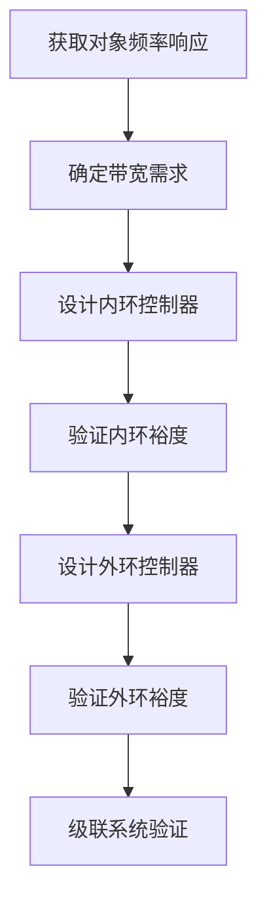

# 01-经典控制基础：频域分析与设计

> 预计阅读：30 分钟 | 前置知识：拉普拉斯变换、传递函数、PID控制基础

---

## 1. 频域分析概述

频域分析是经典控制理论的核心工具。它将时域中的微分方程转化为频域中的代数方程，使复杂系统的分析变得直观。

### 1.1 为什么需要频域分析？

```
时域分析的困难：
├── 高阶系统响应难以直观理解
├── 参数变化对性能的影响难以量化
├── 稳定性判断需要求解特征方程
└── 控制器设计缺乏系统化方法

频域分析的优势：
├── 图形化分析（Bode图、Nyquist图）
├── 稳定裕度提供鲁棒性度量
├── 控制器设计有明确的工程指标
└── 实验辨识方便（频率响应测试）
```

### 1.2 频率响应基本概念

对于线性时不变（LTI）系统，输入正弦信号时，稳态输出也是同频率的正弦信号，但幅值和相位发生变化。

**传递函数的频率响应**：

$$G(j\omega) = |G(j\omega)| \angle G(j\omega)$$

其中：
- $|G(j\omega)|$：幅值（增益）
- $\angle G(j\omega)$：相位

**对数频率特性（Bode 图）**：

$$L(\omega) = 20\log_{10}|G(j\omega)| \quad \text{(dB)}$$
$$\varphi(\omega) = \angle G(j\omega) \quad \text{(度)}$$

---

## 2. Bode 图分析

### 2.1 基本环节的 Bode 图

**积分环节 $1/s$**：
```
幅值：-20 dB/decade 斜率
相位：恒为 -90°
```

**一阶惯性环节 $1/(Ts+1)$**：
```
转折频率：ω = 1/T
低频：0 dB（增益为1）
高频：-20 dB/decade 斜率
相位：0° → -90°（在转折频率处为 -45°）
```

**二阶振荡环节 $\omega_n^2/(s^2 + 2\zeta\omega_n s + \omega_n^2)$**：
```
转折频率：ω = ω_n
低频：0 dB
高频：-40 dB/decade 斜率
相位：0° → -180°
共振峰：当 ζ < 0.707 时出现
```

### 2.2 Bode 图绘制规则

**幅值曲线绘制步骤**：
1. 将传递函数分解为基本环节
2. 确定各环节的转折频率
3. 低频段斜率由积分/微分环节决定
4. 每经过一个转折频率，斜率变化 ±20 dB/decade

**示例**：绘制 $G(s) = \frac{10(s+1)}{s(s+10)}$ 的 Bode 图

```matlab
% MATLAB 绘制 Bode 图
s = tf('s');
G = 10*(s+1) / (s*(s+10));
bode(G);
grid on;
title('Bode图示例');
```

```
幅值(dB)
  40│╲
    │ ╲  -20 dB/dec
  20│  ╲
    │   ╲
   0│────╲──────
    │     ╲     -20 dB/dec
 -20│      ╲
    │       ╲
 -40│        ╲
    └────────────────── ω(rad/s)
        0.1   1    10   100

相位(°)
   0│──╲
    │   ╲
 -45│    ╲──────
    │     ╲
 -90│──────╲────
    │       ╲
-135│        ╲
    │         ╲
-180│──────────╲──
    └────────────────── ω(rad/s)
```

### 2.3 MATLAB Bode 图工具

```matlab
% 基本 Bode 图
bode(G);

% 带网格的 Bode 图
bode(G);
grid on;

% 指定频率范围
bode(G, {0.1, 100});

% 获取幅值和相位数据
[mag, phase, w] = bode(G);

% 计算特定频率处的增益和相位
w0 = 1;  % 特定频率
[mag0, phase0] = bode(G, w0);
fprintf('在 ω = %.1f rad/s 处：增益 = %.2f dB, 相位 = %.1f°\n', ...
        w0, 20*log10(mag0), phase0);
```

---

## 3. 稳定裕度

### 3.1 增益裕度与相位裕度

**增益裕度（Gain Margin, GM）**：

定义：相位穿越频率 $\omega_{180}$ 处的增益裕度

$$GM = \frac{1}{|G(j\omega_{180})|} \quad \text{或} \quad GM_{dB} = -20\log_{10}|G(j\omega_{180})|$$

**相位裕度（Phase Margin, PM）**：

定义：增益穿越频率 $\omega_c$ 处的相位裕度

$$PM = 180° + \angle G(j\omega_c)$$

```
┌─────────────────────────────────────────────────┐
│               稳定裕度示意图                      │
├─────────────────────────────────────────────────┤
│                                                 │
│  幅值(dB)                                       │
│    │                                            │
│   0│─────────────────×─── ← ω_c (增益穿越频率)  │
│    │                 │                          │
│ -GM│                 │ ← 增益裕度                │
│    │                 │                          │
│    └─────────────────┴─────────────── ω         │
│                                                 │
│  相位(°)                                        │
│    │                                            │
│    │  ────────────────                          │
│    │                 ╲                          │
│-180│──────────────────×─── ← ω_180              │
│    │                  │                         │
│ -PM│                  │ ← 相位裕度               │
│    │                  │                         │
│    └──────────────────┴────────────── ω         │
│                                                 │
└─────────────────────────────────────────────────┘
```

### 3.2 稳定裕度的工程意义

| 指标 | 最小要求 | 典型设计值 | 说明 |
|------|---------|-----------|------|
| 增益裕度 GM | > 6 dB | 10-20 dB | GM 过小易不稳定 |
| 相位裕度 PM | > 30° | 45°-65° | PM 过小超调大，过大响应慢 |
| 幅值裕度 | > 2 | > 3 | 离散时间系统考虑 |

**经验法则**：
- PM ≈ 45°：兼顾响应速度和超调
- PM ≈ 60°：较好的鲁棒性
- PM < 30°：系统接近不稳定

### 3.3 MATLAB 稳定裕度计算

```matlab
% 计算稳定裕度
[Gm, Pm, Wcg, Wcp] = margin(G);

fprintf('增益裕度: %.2f dB (在 ω = %.2f rad/s)\n', 20*log10(Gm), Wcg);
fprintf('相位裕度: %.2f° (在 ω = %.2f rad/s)\n', Pm, Wcp);

% 在 Bode 图上标注稳定裕度
margin(G);
```

---

## 4. Nyquist 稳定判据

### 4.1 Nyquist 判据原理

Nyquist 判据通过开环频率响应判断闭环稳定性，是频域分析的理论基础。

**Nyquist 判据**：

设开环传递函数 $G(s)H(s)$ 在右半平面有 $P$ 个极点，则闭环系统稳定的充要条件是：Nyquist 曲线逆时针包围 $(-1, j0)$ 点 $P$ 次。

$$N = Z - P$$

其中：
- $N$：Nyquist 曲线包围 $(-1, j0)$ 点的次数（逆时针为正）
- $Z$：闭环系统在右半平面的极点数
- $P$：开环系统在右半平面的极点数

**稳定条件**：$Z = 0$，即 $N = P$

### 4.2 Nyquist 图绘制

```matlab
% 绘制 Nyquist 图
nyquist(G);
grid on;
title('Nyquist图');

% 指定频率范围
nyquist(G, {0.01, 100});

% 获取数据
[re, im, w] = nyquist(G);
```

**Nyquist 图与 Bode 图的关系**：
- Nyquist 图上的点对应 Bode 图上特定频率的增益和相位
- Nyquist 曲线与单位圆的交点对应 Bode 图的增益穿越频率
- Nyquist 曲线与负实轴的交点对应 Bode 图的相位穿越频率

### 4.3 相对稳定性与 Nyquist 图

```
┌─────────────────────────────────────────────────┐
│              Nyquist 图与稳定裕度                 │
├─────────────────────────────────────────────────┤
│                                                 │
│  虚轴 Im                                        │
│    │                                            │
│    │         ╭───╮                              │
│    │        ╱     ╲                             │
│    │       ╱       ╲                            │
│    │      ╱         ╲                           │
│    │     ╱           ╲                          │
│  ──┼────╱─────────────╲──────→ 实轴 Re          │
│    │   ╱               ╲                        │
│    │  ╱                 ╲                       │
│    │ ╱                   ╲                      │
│    │╱                     ╲                     │
│    │                       ╲                    │
│    │                                            │
│    │  ←── GM ──→│                               │
│    │            │←─ 单位圆                       │
│    │            (-1, j0)                        │
│                                                 │
│  GM = 到 (-1, j0) 的距离裕度                    │
│  PM = Nyquist 曲线与单位圆交点的角度裕度         │
│                                                 │
└─────────────────────────────────────────────────┘
```

---

## 5. 根轨迹法

### 5.1 根轨迹基本概念

根轨迹是开环增益变化时，闭环极点在复平面上的轨迹。

**闭环特征方程**：

$$1 + K \cdot G(s)H(s) = 0$$

即：

$$G(s)H(s) = -\frac{1}{K}$$

**根轨迹条件**：
- 幅值条件：$|G(s)H(s)| = 1/K$
- 相位条件：$\angle G(s)H(s) = (2k+1) \times 180°$

### 5.2 根轨迹绘制规则

| 规则 | 内容 |
|------|------|
| 起点 | 根轨迹起于开环极点（$K=0$） |
| 终点 | 根轨迹终于开环零点或无穷远处（$K→∞$） |
| 分支数 | 等于开环极点数 |
| 对称性 | 关于实轴对称 |
| 渐近线 | $n-m$ 条，角度 $(2k+1)×180°/(n-m)$ |
| 分离点 | $dK/ds = 0$ 的实数解 |
| 与虚轴交点 | 由 Routh 判据或代入 $s=j\omega$ 求得 |

### 5.3 MATLAB 根轨迹工具

```matlab
% 绘制根轨迹
rlocus(G);
grid on;
title('根轨迹');

% 获取特定增益对应的极点
K = 5;
poles = rlocfind(G, K);

% 交互式选择增益
[K, poles] = rlocfind(G);

% 绘制阻尼比和自然频率网格
sgrid;
```

### 5.4 根轨迹设计实例

**设计目标**：通过调整增益 $K$ 使系统具有期望的阻尼比 $\zeta = 0.7$

```matlab
% 被控对象
s = tf('s');
G = 1 / (s*(s+2)*(s+5));

% 绘制根轨迹
rlocus(G);
sgrid(0.7, []);  % 绘制 ζ = 0.7 的等阻尼比线

% 交互式选择增益
[K, poles] = rlocfind(G);

% 验证闭环响应
sys_cl = feedback(K*G, 1);
step(sys_cl);
```

---

## 6. 超前-滞后补偿器设计

### 6.1 超前补偿器（Lead Compensator）

**传递函数**：

$$C_{lead}(s) = K_c \frac{s + z}{s + p} = K_c \alpha \frac{Ts + 1}{\alpha Ts + 1}$$

其中 $\alpha = z/p < 1$（零点在极点左侧）

**作用**：
- 增加相位裕度
- 提高系统带宽
- 改善瞬态响应

**最大超前角**：

$$\varphi_{max} = \arcsin\frac{1-\alpha}{1+\alpha}$$

**最大超前角频率**：

$$\omega_m = \frac{1}{T\sqrt{\alpha}}$$

```
超前补偿器 Bode 图：

相位(°)
  │
  │        ╱╲  ← 最大超前角 φ_max
  │       ╱  ╲
  │      ╱    ╲
  │─────╱──────╲─────
  │    ╱        ╲
  │   ╱          ╲
  │  ╱            ╲
  └──────────────────── ω
       1/T    ω_m   1/(αT)
```

### 6.2 滞后补偿器（Lag Compensator）

**传递函数**：

$$C_{lag}(s) = K_c \frac{s + z}{s + p} = K_c \frac{Ts + 1}{\beta Ts + 1}$$

其中 $\beta = z/p > 1$（零点在极点右侧）

**作用**：
- 提高低频增益，减小稳态误差
- 降低系统带宽，提高鲁棒性
- 对瞬态响应影响小

### 6.3 超前-滞后补偿器

**传递函数**：

$$C(s) = K_c \frac{(s+z_1)(s+z_2)}{(s+p_1)(s+p_2)}$$

**设计步骤**：
1. 确定期望的相位裕度和带宽
2. 设计超前部分：提供相位超前
3. 设计滞后部分：调整低频增益
4. 验证设计指标

### 6.4 MATLAB 补偿器设计

```matlab
% 超前补偿器设计示例
% 被控对象
G = 10 / (s*(s+1));

% 期望：相位裕度 45°，带宽 5 rad/s
% 步骤1：计算需要的超前角
PM_desired = 45;
PM_current = 40;  % 从 Bode 图读取
phi_max = PM_desired - PM_current + 10;  % 加 10° 裕量

% 步骤2：计算 α
alpha = (1 - sin(phi_max*pi/180)) / (1 + sin(phi_max*pi/180));

% 步骤3：确定最大超前角频率
w_m = 5;  % 期望带宽
T = 1 / (w_m * sqrt(alpha));

% 步骤4：构建补偿器
C_lead = K_c * (s + 1/T) / (s + 1/(alpha*T));

% 步骤5：调整增益使穿越频率为 w_m
K_c = 1 / abs(evalfr(G*C_lead, 1j*w_m));

% 验证
margin(G*C_lead);
```

---

## 7. 频域设计在无人机中的应用

### 7.1 姿态控制频域设计

**设计指标**：

| 通道 | 带宽要求 | 相位裕度 | 增益裕度 |
|------|---------|---------|---------|
| 滚转角速率 | 30-50 rad/s | > 45° | > 10 dB |
| 俯仰角速率 | 30-50 rad/s | > 45° | > 10 dB |
| 偏航角速率 | 15-25 rad/s | > 45° | > 10 dB |
| 滚转角 | 5-10 rad/s | > 50° | > 12 dB |
| 俯仰角 | 5-10 rad/s | > 50° | > 12 dB |

**设计流程**：



### 7.2 带宽分离原则

```
频率(rad/s)
    │
100 │  ┌─────────────────────┐
    │  │   电机/电调动态      │
 50 │  └─────────────────────┘
    │         ↑
 30 │  ┌──────┴──────────────┐
    │  │   角速率环带宽       │
 10 │  └──────┬──────────────┘
    │         ↑
  5 │  ┌──────┴──────────────┐
    │  │   角度环带宽         │
  1 │  └──────┬──────────────┘
    │         ↑
0.5 │  ┌──────┴──────────────┐
    │  │   位置环带宽         │
    │  └─────────────────────┘
    └──────────────────────────────
```

**带宽分离原则**：
- 相邻环路带宽比至少 5-10 倍
- 内环带宽 > 外环带宽
- 带宽过高会放大噪声
- 带宽过低会响应慢

### 7.3 MATLAB 频域设计工具

```matlab
% 使用 sisotool 进行交互式设计
sisotool(G);  % 打开 SISO Design Tool

% 使用 Control System Designer
controlSystemDesigner(G);  % 更现代的设计工具

% 频率响应估计（从 Simulink 模型）
% 1. 线性化 Simulink 模型
io = getlinio('model_name');
op = findop('model_name');
sys_linear = linearize('model_name', io, op);

% 2. 绘制频率响应
bode(sys_linear);
margin(sys_linear);
```

---

## 8. 频域分析的局限性

### 8.1 适用条件

频域分析适用于：
- 线性时不变（LTI）系统
- 单输入单输出（SISO）系统（MIMO 需要扩展）
- 稳态分析（瞬态需结合时域）

### 8.2 与现代方法的对比

| 方面 | 频域分析 | 状态空间 | 时域仿真 |
|------|---------|---------|---------|
| 适用系统 | LTI、SISO | LTI、MIMO | 任意系统 |
| 分析工具 | Bode、Nyquist | 矩阵运算 | 数值积分 |
| 设计方法 | 补偿器设计 | 最优控制 | 参数优化 |
| 鲁棒性分析 | 稳定裕度 | 鲁棒控制 | 蒙特卡洛 |
| 直观性 | 高 | 中 | 高 |

---

## 思考题

1. 为什么相位裕度为 45° 通常被认为是较好的设计目标？过小和过大会有什么问题？
2. 超前补偿器和滞后补偿器分别适用于什么场景？在无人机控制中各有什么应用？
3. 请解释 Nyquist 判据中"包围 (-1, j0) 点"的物理意义。
4. 在四旋翼姿态控制中，为什么角速率环的带宽通常比角度环高 5-10 倍？
5. 如何从 Bode 图判断一个系统是否适合使用 PID 控制？

<details>
<summary>参考答案</summary>

1. PM ≈ 45° 的原因：(1) PM < 30° 时系统接近不稳定，超调大，对参数变化敏感；(2) PM ≈ 45° 时二阶系统超调约 25-30%，响应较快；(3) PM > 60° 时系统鲁棒性好但响应变慢。工程中常取 45°-65° 作为设计目标。

2. 超前补偿器适用场景：需要增加相位裕度、提高带宽、改善瞬态响应。在无人机中用于角速率环快速响应。滞后补偿器适用场景：需要提高低频增益、减小稳态误差、提高鲁棒性。在无人机中用于位置环减小稳态漂移。

3. Nyquist 曲线包围 (-1, j0) 点表示开环频率响应在该点附近的相位和增益特性。如果曲线包围该点，说明在某些频率下开环增益大于 1 且相位滞后超过 180°，此时正反馈会导致系统不稳定。

4. 带宽分离的原因：(1) 内环（角速率环）需要快速抑制扰动和模型不确定性；(2) 外环（角度环）通过内环实现，内环可视为"理想化"的执行器；(3) 5-10 倍带宽比确保外环设计时可忽略内环动态；(4) 过小的带宽比会导致级联系统耦合，难以独立设计。

5. 从 Bode 图判断 PID 适用性：(1) 如果系统在感兴趣的频率范围内是稳定的且裕度足够，PID 可能适用；(2) 如果穿越频率处相位接近 -180°，需要谨慎设计 D 项；(3) 如果低频增益不足，需要 I 项；(4) 如果系统有多个共振峰或非最小相位特性，PID 可能不够。

</details>
