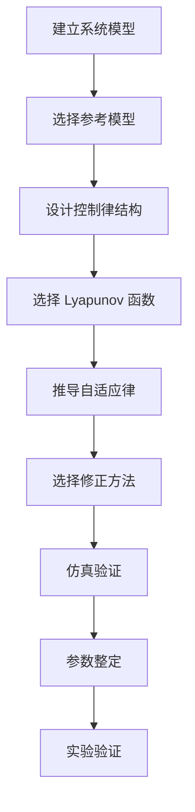

# 02-现代控制方法：模型参考自适应控制 MRAC

> 预计阅读：30 分钟 | 前置知识：状态空间控制、Lyapunov 稳定性、PID控制

---

## 1. MRAC 概述

模型参考自适应控制（Model Reference Adaptive Control, MRAC）是一种自适应控制方法，通过在线调整控制器参数，使被控对象的输出跟踪参考模型的输出。

### 1.1 MRAC 的核心思想

```
┌─────────────────────────────────────────────────┐
│              MRAC 核心思想                        │
├─────────────────────────────────────────────────┤
│                                                 │
│  参考模型：描述期望的闭环行为                     │
│  x_m_dot = A_m x_m + B_m r                      │
│                                                 │
│  被控对象：具有不确定性                           │
│  x_dot = Ax + Bu                                 │
│                                                 │
│  自适应律：在线调整控制器参数                      │
│  使 e = x - x_m → 0                             │
│                                                 │
│  目标：即使参数未知，也能跟踪参考模型              │
│                                                 │
└─────────────────────────────────────────────────┘
```

### 1.2 MRAC 基本结构

```
┌─────────────────────────────────────────────────────────────┐
│                       MRAC 基本结构                          │
├─────────────────────────────────────────────────────────────┤
│                                                             │
│  r(t) ──→ ┌────────┐ ──→ u ──→ ┌────────┐ ──→ x           │
│           │ 自适应 │          │ 被控对象│                   │
│           │ 控制器 │          └────────┘    │               │
│           └───┬────┘                        │               │
│               ↑                             │               │
│               │    ┌────────┐               │               │
│               └────│ 自适应 │←── e ←────────┘               │
│                    │   律   │                               │
│                    └────────┘                               │
│                                                             │
│  r(t) ──→ ┌────────┐ ──→ x_m                              │
│           │ 参考模型│                                       │
│           └────────┘                                        │
│                                                             │
│  误差：e = x - x_m                                          │
│  目标：设计自适应律使 e → 0                                 │
│                                                             │
└─────────────────────────────────────────────────────────────┘
```

---

## 2. MIT 规则

### 2.1 MIT 规则推导

**MIT 规则**是最经典的自适应律，基于梯度下降法。

**性能指标**：

$$J = \frac{1}{2} e^2$$

**梯度下降更新律**：

$$\dot{\theta} = -\gamma \frac{\partial J}{\partial \theta} = -\gamma e \frac{\partial e}{\partial \theta}$$

其中 $\gamma > 0$ 为自适应增益。

### 2.2 MIT 规则的局限性

**问题**：MIT 规则不能保证稳定性，可能出现参数漂移。

**示例**：

```matlab
% MIT 规则示例
% 被控对象：y = θ * u（参数未知）
% 参考模型：y_m = r（期望输出等于参考输入）

% 自适应律
theta_dot = -gamma * e * u;

% 问题：如果 u 持续激励不足，θ 可能漂移到无穷大
```

---

## 3. Lyapunov-based MRAC

### 3.1 Lyapunov 稳定性理论

**Lyapunov 直接法**：如果存在正定函数 $V(\mathbf{x})$ 使得 $\dot{V}(\mathbf{x}) \leq 0$，则系统稳定。

### 3.2 Lyapunov-based MRAC 推导

**系统模型**：

$$\dot{x} = Ax + Bu$$

**参考模型**：

$$\dot{x}_m = A_m x_m + B_m r$$

**控制律**：

$$u = \theta_x^T x + \theta_r^T r$$

**误差动态**：

$$\dot{e} = A_m e + (A - A_m + B\theta_x^T) x + (B\theta_r^T - B_m) r$$

**Lyapunov 函数**：

$$V = e^T P e + \text{tr}(\tilde{\theta}_x^T \Gamma_x^{-1} \tilde{\theta}_x) + \text{tr}(\tilde{\theta}_r^T \Gamma_r^{-1} \tilde{\theta}_r)$$

其中 $P$ 满足 $A_m^T P + P A_m = -Q$，$Q > 0$。

**自适应律**：

$$\dot{\theta}_x = -\Gamma_x x e^T P B$$
$$\dot{\theta}_r = -\Gamma_r r e^T P B$$

### 3.3 MATLAB 实现

```matlab
function [theta_x, theta_r] = MRAC_adaptive(x, x_m, r, ...
    theta_x_prev, theta_r_prev, Am, Bm, B, Gamma_x, Gamma_r, dt)
    % Lyapunov-based MRAC 自适应律

    % 误差
    e = x - x_m;

    % 选择 Q > 0，求解 Lyapunov 方程
    Q = eye(size(Am));
    P = lyap(Am', Q);

    % 自适应律
    theta_x_dot = -Gamma_x * x * e' * P * B;
    theta_r_dot = -Gamma_r * r * e' * P * B;

    % 更新参数
    theta_x = theta_x_prev + theta_x_dot * dt;
    theta_r = theta_r_prev + theta_r_dot * dt;
end
```

---

## 4. Sigma 修正与 e-修正

### 4.1 参数漂移问题

**问题**：当参考输入不够"丰富"（持续激励条件不满足）时，参数可能漂移到无穷大。

**持续激励条件**：存在 $T > 0$ 和 $\alpha > 0$ 使得：

$$\int_t^{t+T} \phi(\tau) \phi^T(\tau) d\tau \geq \alpha I$$

### 4.2 Sigma 修正

**Sigma 修正自适应律**：

$$\dot{\theta} = -\Gamma (e \phi + \sigma (\theta - \theta_0))$$

其中 $\sigma > 0$ 为修正系数，$\theta_0$ 为参数初始值。

**作用**：将参数拉向初始值，防止漂移。

### 4.3 e-修正

**e-修正自适应律**：

$$\dot{\theta} = -\Gamma (e \phi + \sigma |e| \theta)$$

**优势**：当误差 $e$ 为零时，修正项消失，不影响稳态精度。

### 4.4 对比

| 方法 | 自适应律 | 优点 | 缺点 |
|------|---------|------|------|
| MIT 规则 | $\dot{\theta} = -\gamma e \phi$ | 简单 | 无稳定性保证 |
| Lyapunov | $\dot{\theta} = -\Gamma e \phi$ | 稳定性保证 | 需持续激励 |
| Sigma 修正 | $\dot{\theta} = -\Gamma(e \phi + \sigma \tilde{\theta})$ | 防漂移 | 稳态误差 |
| e-修正 | $\dot{\theta} = -\Gamma(e \phi + \sigma |e| \theta)$ | 防漂移，无稳态误差 | 参数振荡 |

---

## 5. MRAC 设计步骤

### 5.1 设计流程



### 5.2 参考模型选择

**选择原则**：
- 参考模型应反映期望的闭环性能
- 参考模型应是稳定的
- 参考模型的阶次应与被控对象匹配

**常用参考模型**：

```matlab
% 一阶参考模型
Am = -a_m;  Bm = a_m;  % a_m > 0

% 二阶参考模型（期望阻尼比和自然频率）
wn = 10;  zeta = 0.7;
Am = [0 1; -wn^2 -2*zeta*wn];
Bm = [0; wn^2];

% 离散参考模型
Am_d = expm(Am * Ts);  % 零阶保持器离散化
Bm_d = Am \ (Am_d - eye(size(Am))) * Bm;
```

### 5.3 自适应增益选择

**自适应增益 $\Gamma$ 的影响**：

| $\Gamma$ 值 | 自适应速度 | 参数振荡 | 稳态精度 |
|-------------|-----------|---------|---------|
| 大 | 快 | 大 | 高 |
| 小 | 慢 | 小 | 低 |

**选择经验**：

```matlab
% 自适应增益选择
Gamma_x = diag([10, 10, 10]);  % 状态反馈增益
Gamma_r = 10;                    % 输入增益

% 如果参数振荡，减小 Gamma
% 如果自适应太慢，增大 Gamma
```

---

## 6. MRAC 在无人机中的应用

### 6.1 四旋翼姿态 MRAC

```matlab
% 四旋翼滚转通道 MRAC
% 系统：Jx * φ_ddot = τ_φ + d

% 参考模型
wn = 10;  zeta = 0.7;
Am = [0 1; -wn^2 -2*zeta*wn];
Bm = [0; wn^2];

% 控制律：u = θ_x' * x + θ_r' * r
% x = [φ, φ_dot]

% 自适应律
Gamma_x = diag([100, 10]);
Gamma_r = 10;

% 仿真
dt = 0.001;
t = 0:dt:5;

% 状态初始化
x = [0; 0];
x_m = [0; 0];
theta_x = [0; 0];
theta_r = 0;

for k = 1:length(t)
    % 参考输入
    r = 0.5 * sin(2*pi*t(k));  % 正弦跟踪

    % 参考模型更新
    x_m_dot = Am * x_m + Bm * r;
    x_m = x_m + x_m_dot * dt;

    % 误差
    e = x - x_m;

    % 控制律
    u = theta_x' * x + theta_r * r;

    % 自适应律
    P = lyap(Am', eye(2));
    theta_x_dot = -Gamma_x * x * e' * P * [0; 1/Jx];
    theta_r_dot = -Gamma_r * r * e' * P * [0; 1/Jx];

    % 参数更新
    theta_x = theta_x + theta_x_dot * dt;
    theta_r = theta_r + theta_r_dot * dt;

    % 系统更新
    x_dot = [x(2); (u + 0.1*sin(t(k)))/Jx];  % 含扰动
    x = x + x_dot * dt;
end
```

### 6.2 MRAC 级联控制

```
┌─────────────────────────────────────────────────┐
│           四旋翼 MRAC 级联控制                    │
├─────────────────────────────────────────────────┤
│                                                 │
│  位置参考 ──→ [位置 MRAC] ──→ 姿态参考           │
│                    │                            │
│                    ↓                            │
│              [姿态 MRAC] ──→ 力矩               │
│                    │                            │
│                    ↓                            │
│              [角速率 MRAC] ──→ 电机控制量         │
│                                                 │
│  优点：                                         │
│  ├── 自动适应参数变化                            │
│  ├── 不需要精确模型                              │
│  └── 保证跟踪性能                               │
│                                                 │
│  缺点：                                         │
│  ├── 需要持续激励                               │
│  ├── 自适应速度可能不够快                        │
│  └── 参数整定较复杂                              │
│                                                 │
└─────────────────────────────────────────────────┘
```

---

## 7. MRAC 与其他方法的对比

### 7.1 MRAC vs PID

| 方面 | PID | MRAC |
|------|-----|------|
| 参数调整 | 离线整定 | 在线自适应 |
| 模型依赖 | 不依赖 | 需要参考模型 |
| 参数变化适应 | 有限 | 强 |
| 稳定性保证 | 无（需调参） | 有（Lyapunov） |
| 计算复杂度 | 低 | 中 |
| 工程实用性 | 高 | 中 |

### 7.2 MRAC vs ADRC

| 方面 | ADRC | MRAC |
|------|------|------|
| 核心思想 | 估计并补偿扰动 | 调整参数跟踪参考模型 |
| 模型依赖 | 不依赖 | 需要参考模型 |
| 扰动处理 | ESO 估计 | 自适应补偿 |
| 参数数量 | 5-8 | 多（取决于结构） |
| 调参方法 | 带宽法 | 自适应增益 |
| 适用场景 | 扰动大、模型不确定 | 参数变化大 |

---

## 8. 总结

### 8.1 MRAC 的关键特性

| 特性 | 说明 |
|------|------|
| 在线自适应 | 自动调整参数适应变化 |
| 参考模型 | 定义期望的闭环行为 |
| 稳定性保证 | Lyapunov 方法保证稳定 |
| 不需要精确模型 | 只需知道相对阶和符号 |
| 持续激励 | 需要充分激励以保证参数收敛 |

### 8.2 选择建议

```
何时选择 MRAC？
├── 参数变化范围大
├── 需要保证跟踪性能
├── 可以提供持续激励
├── 能接受参考模型设计
└── 有足够计算资源

何时选择其他方法？
├── PID：参数变化小，追求简单
├── ADRC：扰动为主，不想设计参考模型
├── MPC：有约束要求
└── 鲁棒控制：需要严格性能保证
```

---

## 思考题

1. MRAC 的参考模型如何选择？如果选择不当会有什么后果？
2. 为什么 MIT 规则可能导致参数漂移？Lyapunov 方法如何解决这个问题？
3. Sigma 修正和 e-修正在防止参数漂移方面有什么区别？
4. 在四旋翼控制中，MRAC 的持续激励条件如何满足？
5. MRAC 和 ADRC 在处理参数不确定性方面有什么异同？

<details>
<summary>参考答案</summary>

1. 参考模型选择原则：(1) 反映期望性能（带宽、阻尼比）；(2) 与被控对象同阶；(3) 稳定。选择不当后果：(1) 模型太快：自适应跟不上，跟踪误差大；(2) 模型太慢：性能浪费；(3) 模型不稳定：无法实现。

2. MIT 规则问题：(1) 基于梯度下降，无稳定性保证；(2) 当输入不充分激励时，梯度可能为零，参数停止更新或漂移。Lyapunov 方法：(1) 选择正定 V 函数；(2) 保证 V_dot ≤ 0，参数有界；(3) 误差渐近收敛。

3. Sigma 修正：$\dot{\theta} = -\Gamma(e \phi + \sigma \tilde{\theta})$，将参数拉向初始值，即使 e=0 也有修正项，导致稳态误差。e-修正：$\dot{\theta} = -\Gamma(e \phi + \sigma |e| \theta)$，仅在 e≠0 时修正，稳态时 e=0 无修正，无稳态误差。

4. 满足持续激励的方法：(1) 使用正弦、多正弦等持续激励信号；(2) 在参考输入中加入小幅度高频信号（dither）；(3) 使用多个工作点的参考信号；(4) 实际飞行中，机动动作自然提供激励。

5. 异同：(1) 相同：都处理参数不确定性，不需精确模型；(2) 不同：ADRC 通过估计扰动补偿，MRAC 通过调整参数适应；(3) ADRC 对扰动响应快，MRAC 对参数变化适应好；(4) 工程中可结合使用（ADRC+MRAC）。

</details>
