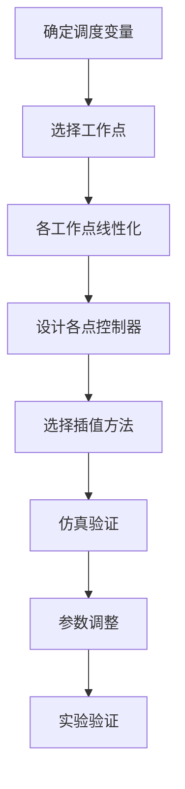

# 02-现代控制方法：增益调度控制

> 预计阅读：25 分钟 | 前置知识：状态空间控制、线性化、PID控制

---

## 1. 增益调度概述

增益调度（Gain Scheduling）是一种处理非线性系统的实用方法：在不同工作点设计线性控制器，根据当前工作状态切换或插值控制器参数。

### 1.1 增益调度的核心思想

```
┌─────────────────────────────────────────────────┐
│              增益调度核心思想                      │
├─────────────────────────────────────────────────┤
│                                                 │
│  非线性系统：                                     │
│  ẋ = f(x, u)                                    │
│                                                 │
│  在工作点线性化：                                  │
│  ẋ = A_i x + B_i u                              │
│                                                 │
│  设计多个线性控制器：                              │
│  u = -K_i x                                     │
│                                                 │
│  根据调度变量切换/插值：                           │
│  u = -K(ρ) x，ρ 为调度变量                       │
│                                                 │
└─────────────────────────────────────────────────┘
```

### 1.2 适用场景

| 场景 | 说明 |
|------|------|
| 工作范围宽 | 不同飞行状态特性差异大 |
| 模型已知 | 能建立不同工作点的线性模型 |
| 调度变量可测 | 能实时获取调度变量 |
| 计算资源有限 | 不能实时求解非线性优化 |

---

## 2. LPV 模型

### 2.1 线性参数变化（LPV）模型

**LPV 模型**：

$$\dot{x} = A(\rho)x + B(\rho)u$$
$$y = C(\rho)x + D(\rho)u$$

其中 $\rho(t)$ 为时变的调度变量（如速度、高度、质量）。

### 2.2 四旋翼 LPV 模型

```matlab
% 四旋翼 LPV 模型
% 调度变量：飞行速度 V

% 不同速度下的线性化模型
V_points = [0, 5, 10, 15, 20];  % m/s

% 存储线性化模型
A_cell = cell(length(V_points), 1);
B_cell = cell(length(V_points), 1);

for i = 1:length(V_points)
    V = V_points(i);
    % 在速度 V 处线性化
    [A_i, B_i] = linearize_quadrotor(V);
    A_cell{i} = A_i;
    B_cell{i} = B_i;
end

% 构建 LPV 模型
% A(ρ) = Σ α_i(ρ) A_i
% B(ρ) = Σ α_i(ρ) B_i
```

### 2.3 LPV 控制器设计

```matlab
% LPV 控制器设计
% 使用 MATLAB Robust Control Toolbox

% 定义调度变量
rho = pgrid('rho', V_points);

% 创建参数变化矩阵
A_lpv = pmat(A_cell, rho);
B_lpv = pmat(B_cell, rho);

% 设计 LPV 控制器
[K_lpv, info] = lpvsyn(P_lpv, 1, 1);
```

---

## 3. 插值方法

### 3.1 常用插值方法

| 方法 | 公式 | 特点 |
|------|------|------|
| 最近邻 | $K = K_i$（最近的工作点） | 简单，不连续 |
| 线性插值 | $K = \alpha K_1 + (1-\alpha) K_2$ | 连续，平滑 |
| 三次样条 | 样条插值 | 更平滑，计算量大 |

### 3.2 线性插值实现

```matlab
function K = gain_interpolation(rho, rho_points, K_points)
    % 增益线性插值
    % rho: 当前调度变量
    % rho_points: 调度变量网格点
    % K_points: 各点的控制器增益

    % 寻找相邻点
    idx = find(rho_points <= rho, 1, 'last');
    if isempty(idx)
        idx = 1;
    elseif idx == length(rho_points)
        idx = length(rho_points) - 1;
    end

    % 计算插值权重
    alpha = (rho - rho_points(idx)) / (rho_points(idx+1) - rho_points(idx));

    % 线性插值
    K = (1 - alpha) * K_points{idx} + alpha * K_points{idx+1};
end
```

---

## 4. 调度变量选择

### 4.1 调度变量选择原则

```
┌─────────────────────────────────────────────────┐
│              调度变量选择原则                      │
├─────────────────────────────────────────────────┤
│                                                 │
│  1. 可测量：能实时获取                            │
│  2. 反映非线性：与系统特性强相关                   │
│  3. 变化慢：比系统动态慢（准稳态假设）             │
│  4. 维度低：避免维数灾难                          │
│                                                 │
│  常用调度变量：                                   │
│  ├── 飞行速度                                   │
│  ├── 飞行高度                                   │
│  ├── 质量（载荷变化）                            │
│  ├── 动压                                       │
│  └── 姿态角（大角度机动）                        │
│                                                 │
└─────────────────────────────────────────────────┘
```

### 4.2 四旋翼调度变量示例

```matlab
% 四旋翼增益调度：调度变量为飞行速度
% 速度范围：0-20 m/s
V_range = 0:2:20;

% 各速度下的 PID 参数
Kp_roll = [5.0, 4.8, 4.5, 4.0, 3.5, 3.0, 2.5, 2.0, 1.8, 1.5, 1.2];
Ki_roll = [0.2, 0.2, 0.2, 0.2, 0.2, 0.2, 0.2, 0.2, 0.2, 0.2, 0.2];
Kd_roll = [0.05, 0.05, 0.05, 0.05, 0.05, 0.05, 0.05, 0.05, 0.05, 0.05, 0.05];

% 在线插值
V_current = 7.5;  % 当前速度
Kp = interp1(V_range, Kp_roll, V_current, 'linear');
Ki = interp1(V_range, Ki_roll, V_current, 'linear');
Kd = interp1(V_range, Kd_roll, V_current, 'linear');
```

---

## 5. 增益调度设计流程

### 5.1 设计流程图



### 5.2 MATLAB 增益调度工具

```matlab
% 使用 Control System Designer 设计增益调度控制器

% 1. 打开 Control System Designer
controlSystemDesigner;

% 2. 在不同工作点设计控制器
% 工作点1：悬停
[A1, B1] = linearize_quadrotor(0);
C1 = lqr(A1, B1, Q, R);

% 工作点2：巡航
[A2, B2] = linearize_quadrotor(10);
C2 = lqr(A2, B2, Q, R);

% 3. 创建增益调度控制器
K_gs = tunableGain('K_gs', 2, 2);
```

---

## 6. 增益调度的工程实践

### 6.1 PX4 增益调度

PX4 飞控中使用增益调度处理不同飞行模式：

```
PX4 增益调度示例：

悬停模式（低速）：
├── 位置环：MPC_XY_P = 1.0
├── 速度环：MPC_XY_VEL_P_ACC = 1.8
└── 姿态环：MC_ROLL_P = 6.5

巡航模式（高速）：
├── 位置环：MPC_XY_P = 0.8
├── 速度环：MPC_XY_VEL_P_ACC = 1.5
└── 姿态环：MC_ROLL_P = 5.0

切换条件：
├── 速度阈值：V > 5 m/s 切换到巡航模式
└── 平滑过渡：使用低通滤波器
```

### 6.2 平滑切换

```matlab
% 平滑切换增益调度
function K = smooth_gain_scheduling(V, V_threshold, K_hover, K_cruise)
    % 使用 sigmoid 函数平滑切换
    alpha = 1 / (1 + exp(-10 * (V - V_threshold)));
    K = (1 - alpha) * K_hover + alpha * K_cruise;
end
```

---

## 7. 增益调度与其他方法对比

| 方法 | 优势 | 劣势 | 适用场景 |
|------|------|------|---------|
| 增益调度 | 简单、工程实用 | 需要线性化模型 | 工作点变化明确 |
| MPC | 显式约束处理 | 计算量大 | 约束严格 |
| 非线性控制 | 理论严格 | 设计复杂 | 非线性强 |
| 自适应控制 | 在线调整 | 需要持续激励 | 参数不确定性 |

---

## 思考题

1. 增益调度的"准稳态假设"是什么？在什么情况下会失效？
2. 如何选择合适的调度变量？请举例说明。
3. 增益调度控制器的平滑切换为什么重要？有哪些实现方法？
4. LPV 控制器与增益调度有什么区别？
5. 在四旋翼控制中，哪些参数适合作为调度变量？

<details>
<summary>参考答案</summary>

1. 准稳态假设：调度变量的变化速度远慢于系统动态，可认为在每个采样时刻系统是线性的。失效情况：(1) 快速机动时速度变化快；(2) 调度变量跳变（如载荷投放）；(3) 系统动态与调度变量频率接近。

2. 选择调度变量：(1) 反映主要非线性来源（如速度影响气动特性）；(2) 可实时测量；(3) 变化范围明确。示例：四旋翼选飞行速度（影响阻力），直升机选前飞速度（影响旋翼气动）。

3. 平滑切换重要性：(1) 避免增益跳变导致控制量突变；(2) 防止执行器冲击；(3) 提高飞行品质。实现方法：(1) 线性插值；(2) 低通滤波；(3) Sigmoid 函数；(4) 模糊插值。

4. 区别：(1) 增益调度：在各点独立设计，插值连接；(2) LPV：将参数变化显式纳入模型，统一设计控制器；(3) LPV 有理论保证（稳定性、性能），增益调度依赖工程验证；(4) LPV 设计更复杂。

5. 四旋翼调度变量：(1) 飞行速度（影响阻力和气动）；(2) 质量（载荷变化）；(3) 高度（空气密度变化）；(4) 电池电压（影响电机推力）；(5) 通常选速度为主要调度变量。

</details>
