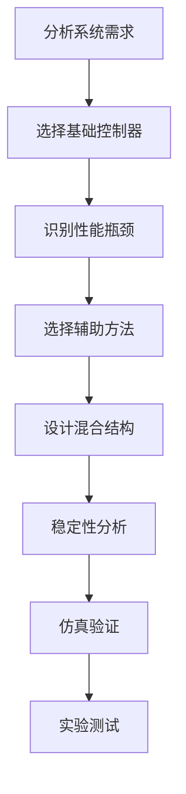

# 04-自适应与智能控制：混合智能控制

> 预计阅读：25 分钟 | 前置知识：神经网络、模糊控制、强化学习、滑模控制

---

## 1. 混合智能控制概述

混合智能控制是将多种控制方法结合，发挥各自优势，弥补各自不足的控制策略。

### 1.1 为什么需要混合控制？

```
┌─────────────────────────────────────────────────┐
│              单一方法的局限性                      │
├─────────────────────────────────────────────────┤
│                                                 │
│  PID：简单但性能有限                              │
│  SMC：鲁棒但有抖振                               │
│  NN：逼近能力强但可解释性差                       │
│  模糊：利用专家知识但精度有限                     │
│  RL：自动学习但安全性难保证                       │
│  MPC：处理约束但计算量大                         │
│                                                 │
│  混合控制：取长补短，综合优势                     │
│                                                 │
└─────────────────────────────────────────────────┘
```

### 1.2 混合控制的设计原则

| 原则 | 说明 |
|------|------|
| 互补性 | 各方法优势互补 |
| 简洁性 | 结构尽可能简单 |
| 稳定性 | 保证闭环稳定 |
| 实用性 | 便于工程实现 |

---

## 2. NN + SMC 混合控制

### 2.1 设计思想

**NN**：逼近未知非线性
**SMC**：提供鲁棒性，抑制不确定性

### 2.2 控制律设计

**系统**：$\dot{x} = f(x) + bu + d$

**NN 逼近**：$f(x) = W^{*T} \Phi(x) + \epsilon$

**滑模面**：$s = \dot{e} + \lambda e$

**控制律**：

$$u = \frac{1}{b}(-\hat{W}^T \Phi(x) - \lambda \dot{e} - k \cdot \text{sign}(s))$$

**权值更新**：

$$\dot{\hat{W}} = \Gamma \Phi(x) s$$

### 2.3 Lyapunov 稳定性证明

NN+SMC 混合控制的稳定性需要同时考虑滑模面收敛和 NN 权值估计误差的有界性。下面给出完整的 Lyapunov 稳定性分析。

**定义权值估计误差**：

$$\tilde{W} = \hat{W} - W^*$$

其中 $W^*$ 为最优权值，满足 $f(x) = W^{*T}\Phi(x) + \epsilon$，$\epsilon$ 为 NN 逼近误差，假设 $|\epsilon| \leq \bar{\epsilon}$。

**选取 Lyapunov 函数**：

$$V = \frac{1}{2}s^2 + \frac{1}{2}\text{tr}(\tilde{W}^T \Gamma^{-1} \tilde{W})$$

第一项对应滑模面的能量，第二项对应权值估计误差的能量，$\Gamma > 0$ 为对角正定学习率矩阵。

**求导**：

$$\dot{V} = s\dot{s} + \text{tr}(\tilde{W}^T \Gamma^{-1} \dot{\tilde{W}})$$

由滑模面定义 $s = \dot{e} + \lambda e$，对时间求导：

$$\dot{s} = \ddot{e} + \lambda \dot{e} = \ddot{x} - \ddot{x}_d + \lambda \dot{e}$$

将系统动力学 $\dot{x} = f(x) + bu + d$ 和控制律代入：

$$\dot{s} = f(x) + bu + d - \ddot{x}_d + \lambda \dot{e}$$

$$= W^{*T}\Phi(x) + \epsilon + d + (-\hat{W}^T\Phi(x) - \lambda\dot{e} - k\cdot\text{sign}(s)) - \ddot{x}_d + \lambda\dot{e}$$

$$= -\tilde{W}^T\Phi(x) + (\epsilon + d) - k\cdot\text{sign}(s)$$

其中 $\lambda\dot{e}$ 项在代入后相互抵消。

**代入 Lyapunov 导数**：

$$\dot{V} = s[-\tilde{W}^T\Phi(x) + (\epsilon + d) - k\cdot\text{sign}(s)] + \text{tr}(\tilde{W}^T \Gamma^{-1} \dot{\tilde{W}})$$

由于 $\dot{\tilde{W}} = \dot{\hat{W}} = \Gamma\Phi(x)s$，代入得：

$$\dot{V} = -s\tilde{W}^T\Phi(x) + s(\epsilon + d) - ks|s| + \text{tr}(\tilde{W}^T \Gamma^{-1} \Gamma\Phi(x)s)$$

$$= -s\tilde{W}^T\Phi(x) + s(\epsilon + d) - k|s| + s\Phi^T(x)\tilde{W}$$

注意 $s\tilde{W}^T\Phi(x) = s\Phi^T(x)\tilde{W}$（标量），因此两项**精确抵消**（交叉项消去）：

$$\dot{V} = s(\epsilon + d) - k|s|$$

**稳定性结论**：

$$\dot{V} \leq |s||\epsilon + d| - k|s| = |s|(|\epsilon + d| - k)$$

当切换增益满足 $k > \bar{\epsilon} + \bar{d}$（即 $k$ 大于 NN 逼近误差上界与外部扰动上界之和）时：

$$\dot{V} \leq -(|\epsilon + d| - k)|s| < 0, \quad \forall s \neq 0$$

**关键设计启示**：

```
┌─────────────────────────────────────────────────────────┐
│         NN+SMC 稳定性分析的关键洞察                       │
├─────────────────────────────────────────────────────────┤
│                                                         │
│  1. 交叉项消去：权值更新律 ΓΦ(x)s 的设计                   │
│     使得 NN 权值误差与滑模面的交叉项精确抵消                │
│     这是自适应控制中"σ修正"或"e-修正"的经典技巧             │
│                                                         │
│  2. NN 逼近误差 ε 的处理：                                │
│     ε 无法消除，但 SMC 的切换增益 k 可以"覆盖"它            │
│     只要 k > |ε + d|，系统就保持稳定                       │
│                                                         │
│  3. 工程意义：                                           │
│     NN 越精确 → ε 越小 → 所需 k 越小 → 抖振越小            │
│     这正是 NN+SMC 混合的核心优势：                         │
│     NN 减小了纯 SMC 所需的大切换增益                        │
│                                                         │
│  4. 局限性：                                             │
│     该证明保证 s → 0（滑模面收敛）                         │
│     但 NN 权值误差 W̃ 仅保证有界，不一定收敛到零             │
│     需持续激励(PE)条件才能保证 W̃ → 0                      │
│                                                         │
└─────────────────────────────────────────────────────────┘
```

### 2.4 MATLAB 实现

```matlab
function [u, W_hat] = NN_SMC_control(x, x_d, x_dot_d, W_hat, ...
    lambda, k, Gamma, centers, widths, b, dt)
    % NN-SMC 混合控制

    % RBF NN
    [~, Phi] = RBF_NN(x, W_hat, centers, widths);
    f_hat = W_hat' * Phi;

    % 误差
    e = x - x_d;
    edot = x_dot - x_dot_d;

    % 滑模面
    s = edot + lambda * e;

    % 控制律
    u = (1/b) * (-f_hat - lambda*edot - k*sign(s));

    % 权值更新
    W_hat_dot = Gamma * Phi * s;
    W_hat = W_hat + W_hat_dot * dt;
end
```

---

## 3. Fuzzy + PID 混合控制

### 3.1 设计思想

**PID**：基本控制框架
**模糊控制**：在线调整 PID 参数

### 3.2 结构框图

```
┌─────────────────────────────────────────────────┐
│              模糊 PID 控制结构                    │
├─────────────────────────────────────────────────┤
│                                                 │
│  r(t) ──→ [PID] ──→ u ──→ [被控对象] ──→ y      │
│              ↑                    │             │
│              │                    │             │
│         ┌────┴────┐               │             │
│         │  模糊   │←── e, ec ←────┘             │
│         │  调参   │                             │
│         └─────────┘                             │
│                                                 │
│  模糊控制器调整 Kp, Ki, Kd                       │
│  根据误差 e 和误差变化率 ec                       │
│                                                 │
└─────────────────────────────────────────────────┘
```

### 3.3 MATLAB 实现

```matlab
function [u, Kp, Ki, Kd] = Fuzzy_PID(e, ec, Kp0, Ki0, Kd0, rules)
    % 模糊 PID 控制

    % 模糊推理调整 PID 参数
    delta_Kp = fuzzy_inference(e, ec, rules.Kp);
    delta_Ki = fuzzy_inference(e, ec, rules.Ki);
    delta_Kd = fuzzy_inference(e, ec, rules.Kd);

    % 更新 PID 参数
    Kp = Kp0 + delta_Kp;
    Ki = Ki0 + delta_Ki;
    Kd = Kd0 + delta_Kd;

    % PID 控制
    u = Kp * e + Ki * integral_e + Kd * derivative_e;
end
```

---

## 4. RL + MPC 混合控制

### 4.1 设计思想

**MPC**：处理约束，提供安全保证
**RL**：学习最优策略，提高性能

### 4.2 结构框图

```
┌─────────────────────────────────────────────────┐
│              RL-MPC 混合控制                      │
├─────────────────────────────────────────────────┤
│                                                 │
│  State ──→ [RL Policy] ──→ u_rl                 │
│                │                                │
│                ↓                                │
│           [MPC 修正] ──→ u_mpc                  │
│                │                                │
│                ↓                                │
│           [安全检查] ──→ u_final                 │
│                                                 │
│  RL 提供初始控制量                                │
│  MPC 修正以满足约束                               │
│  安全检查确保可行性                               │
│                                                 │
└─────────────────────────────────────────────────┘
```

### 4.3 MATLAB 实现

```matlab
function u = RL_MPC_control(state, rl_policy, mpc_controller)
    % RL-MPC 混合控制

    % RL 策略输出
    u_rl = rl_policy(state);

    % MPC 修正（满足约束）
    u_mpc = mpc_controller.solve(state, u_rl);

    % 安全检查
    if is_safe(u_mpc, state)
        u = u_mpc;
    else
        u = safe_backup(state);
    end
end
```

---

## 5. 混合控制在无人机中的应用

### 5.1 自适应滑模 NN 控制

```matlab
function [tau, W_hat] = adaptive_SMC_NN_attitude(phi, theta, psi, ...
    p, q, r, W_hat, params)
    % 自适应滑模 NN 姿态控制

    % NN 逼近不确定性
    x = [phi; theta; psi; p; q; r];
    [f_nn, Phi] = RBF_NN(x, W_hat, params.centers, params.widths);

    % 滑模面
    e = [phi - params.phi_ref; theta - params.theta_ref; psi - params.psi_ref];
    s = e + params.lambda * integral_e;

    % 控制律
    tau = -f_nn - params.lambda * e_dot - params.k * sign(s);

    % 权值更新
    W_hat_dot = params.Gamma * Phi * s';
    W_hat = W_hat + W_hat_dot * params.dt;
end
```

### 5.2 分层混合控制

```
┌─────────────────────────────────────────────────┐
│              分层混合控制架构                      │
├─────────────────────────────────────────────────┤
│                                                 │
│  决策层：RL/模糊                                 │
│  ├── 模式切换                                   │
│  ├── 任务分配                                   │
│  └── 异常处理                                   │
│                                                 │
│  规划层：MPC/最优控制                             │
│  ├── 轨迹优化                                   │
│  └── 约束处理                                   │
│                                                 │
│  控制层：PID/SMC/ADRC                            │
│  ├── 姿态控制                                   │
│  └── 角速率控制                                  │
│                                                 │
│  执行层：电机混控                                │
│  └── 推力分配                                   │
│                                                 │
└─────────────────────────────────────────────────┘
```

---

## 6. 混合控制设计方法

### 6.1 设计流程



### 6.2 稳定性分析

**Lyapunov 方法**：

$$V = V_{base} + V_{auxiliary}$$

$$\dot{V} = \dot{V}_{base} + \dot{V}_{auxiliary} \leq 0$$

### 6.3 参数整定

| 参数 | 整定方法 |
|------|---------|
| 基础控制器参数 | 先单独整定 |
| 辅助方法参数 | 在线自适应或离线优化 |
| 混合权重 | 仿真调参 |

---

## 7. 混合控制对比

| 混合方法 | 优势 | 适用场景 |
|---------|------|---------|
| NN+SMC | 逼近+鲁棒 | 不确定性大 |
| Fuzzy+PID | 经验+简单 | 快速部署 |
| RL+MPC | 学习+约束 | 复杂约束 |
| ADRC+SMC | 抗扰+鲁棒 | 大扰动 |

---

## 思考题

1. NN+SMC 混合控制中，NN 和 SMC 各自的作用是什么？
2. 模糊 PID 控制如何利用专家知识？
3. RL+MPC 混合控制中，如何保证安全性？
4. 分层混合控制架构中，各层的职责是什么？
5. 如何进行混合控制的稳定性分析？

<details>
<summary>参考答案</summary>

1. 各自作用：(1) NN：逼近未知非线性函数 f(x)，减少模型依赖；(2) SMC：提供鲁棒性，抑制 NN 逼近误差和外部扰动；(3) 结合：NN 减小 SMC 的切换增益需求，SMC 保证 NN 失效时的稳定性。

2. 利用专家知识：(1) 模糊规则表反映专家经验；(2) 例如：误差大时增大 Kp，误差变化快时增大 Kd；(3) 隶属度函数设计体现专家偏好；(4) 在线调整弥补规则不完善。

3. 保证安全性：(1) MPC 显式处理约束；(2) RL 输出经 MPC 修正；(3) 安全检查层验证可行性；(4) 备用安全控制器处理异常。

4. 各层职责：(1) 决策层：高层任务规划和模式管理；(2) 规划层：轨迹优化和约束处理；(3) 控制层：快速稳定的底层控制；(4) 执行层：控制量分配和执行。

5. 稳定性分析：(1) 分别分析各子系统的 Lyapunov 稳定性；(2) 构造组合 Lyapunov 函数；(3) 证明组合系统的导数负定；(4) 对于切换系统，使用共同 Lyapunov 函数。

</details>
