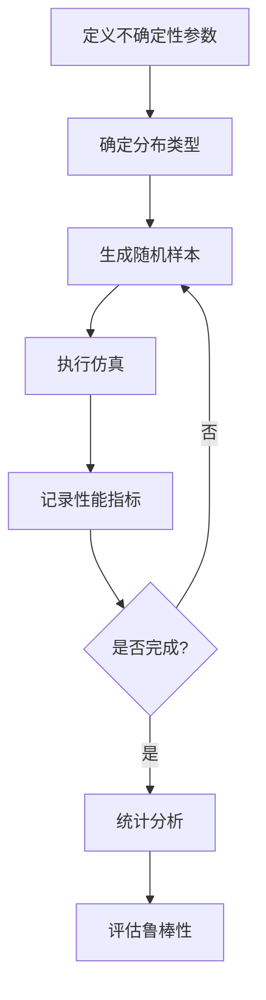

# 05-Simulink仿真验证：蒙特卡洛仿真与鲁棒性验证

> 预计阅读：30 分钟 | 前置知识：Simulink基础、概率统计、控制理论

---

## 1. 蒙特卡洛仿真概述

蒙特卡洛（Monte Carlo）仿真是一种通过随机采样评估系统性能的统计方法，特别适合验证控制器在不确定条件下的鲁棒性。

### 1.1 核心思想

```
┌─────────────────────────────────────────────────┐
│              蒙特卡洛仿真核心思想                  │
├─────────────────────────────────────────────────┤
│                                                 │
│  问题：系统存在不确定性                           │
│  ├── 参数不确定性（质量、惯量）                   │
│  ├── 模型不确定性（气动参数）                     │
│  ├── 外部扰动（风扰动）                          │
│  └── 传感器噪声                                  │
│                                                 │
│  解决：随机采样 + 大量仿真                        │
│  ├── 从不确定性分布中采样                        │
│  ├── 对每个样本进行仿真                          │
│  ├── 统计分析性能指标                            │
│  └── 评估鲁棒性                                 │
│                                                 │
└─────────────────────────────────────────────────┘
```

### 1.2 仿真流程



---

## 2. 参数不确定性建模

### 2.1 常见不确定性分布

| 参数 | 分布类型 | 典型范围 |
|------|---------|---------|
| 质量 | 正态分布 | ±20% |
| 转动惯量 | 正态分布 | ±15% |
| 气动参数 | 均匀分布 | ±30% |
| 风扰动 | 均匀/正态 | 0-10 m/s |
| 传感器噪声 | 正态分布 | 取决于传感器 |

### 2.2 MATLAB 随机数生成

```matlab
% 参数不确定性建模

% 1. 正态分布
N = 1000;  % 仿真次数
m = 1.5;   % 标称质量
sigma_m = 0.3;  % 质量标准差
mass_samples = m + sigma_m * randn(N, 1);

% 2. 均匀分布
wind_speed_max = 10;  % 最大风速
wind_samples = wind_speed_max * (2*rand(N, 3) - 1);

% 3. 截断正态分布
Jx = 0.01;
Jx_sigma = 0.002;
Jx_samples = truncate_normal(Jx, Jx_sigma, Jx*0.7, Jx*1.3, N);

function samples = truncate_normal(mu, sigma, lower, upper, N)
    % 截断正态分布
    samples = [];
    while length(samples) < N
        x = mu + sigma * randn();
        if x >= lower && x <= upper
            samples = [samples; x];
        end
    end
end
```

---

## 3. 蒙特卡洛仿真实现

### 3.1 基本实现

```matlab
function results = monte_carlo_simulation(model_name, N, params)
    % 蒙特卡洛仿真
    % model_name: Simulink 模型名
    % N: 仿真次数
    % params: 不确定性参数

    % 预分配结果
    results.tracking_error = zeros(N, 1);
    results.settling_time = zeros(N, 1);
    results.max_overshoot = zeros(N, 1);
    results.control_effort = zeros(N, 1);

    for i = 1:N
        % 生成随机参数
        mass = params.mass_nominal + params.mass_sigma * randn();
        Jx = params.Jx_nominal + params.Jx_sigma * randn();
        wind = params.wind_max * (2*rand(3,1) - 1);

        % 设置模型参数
        set_param([model_name '/Plant'], 'mass', num2str(mass));
        set_param([model_name '/Plant'], 'Jx', num2str(Jx));
        set_param([model_name '/Wind'], 'value', mat2str(wind));

        % 执行仿真
        sim_out = sim(model_name, 'StopTime', '10');

        % 记录结果
        results.tracking_error(i) = compute_tracking_error(sim_out);
        results.settling_time(i) = compute_settling_time(sim_out);
        results.max_overshoot(i) = compute_overshoot(sim_out);
        results.control_effort(i) = compute_control_effort(sim_out);

        % 进度显示
        if mod(i, 100) == 0
            fprintf('完成 %d/%d 次仿真\n', i, N);
        end
    end
end
```

### 3.2 并行仿真

```matlab
function results = parallel_monte_carlo(model_name, N, params)
    % 并行蒙特卡洛仿真

    % 启动并行池
    if isempty(gcp('nocreate'))
        parpool('local');
    end

    % 预分配结果
    results = struct('tracking_error', cell(N,1), ...
                     'settling_time', cell(N,1), ...
                     'max_overshoot', cell(N,1));

    parfor i = 1:N
        % 生成随机参数
        mass = params.mass_nominal + params.mass_sigma * randn();
        wind = params.wind_max * (2*rand(3,1) - 1);

        % 本地模型副本
        model_name_local = [model_name '_', num2str(i)];
        load_system(model_name);
        save_system(model_name, model_name_local);

        % 设置参数并仿真
        set_param([model_name_local '/Plant'], 'mass', num2str(mass));
        sim_out = sim(model_name_local, 'StopTime', '10');

        % 记录结果
        results(i).tracking_error = compute_tracking_error(sim_out);

        % 清理
        close_system(model_name_local, 0);
    end
end
```

---

## 4. 扰动注入

### 4.1 风扰动模型

```matlab
function wind = generate_wind_profile(t, params)
    % 生成风扰动剖面

    % 1. 常值风
    wind_constant = params.wind_mean;

    % 2. 阵风
    gust_amplitude = params.gust_amplitude;
    gust_frequency = params.gust_frequency;
    wind_gust = gust_amplitude * sin(2*pi*gust_frequency*t);

    % 3. 紊流（Dryden 模型）
    wind_turbulence = dryden_turbulence(t, params);

    % 总风扰动
    wind = wind_constant + wind_gust + wind_turbulence;
end

function wind_t = dryden_turbulence(t, params)
    % Dryden 紊流模型
    % 参数
    L_u = 200;  % 纵向紊流长度尺度
    sigma_u = params.turbulence_intensity;

    % 传递函数
    s = tf('s');
    H_u = sigma_u * sqrt(2*L_u/pi) / (s + 1/L_u);

    % 生成白噪声输入
    dt = 0.01;
    noise = randn(length(t), 1);

    % 滤波得到紊流
    [wind_t, ~] = lsim(H_u, noise, t);
end
```

### 4.2 传感器噪声

```matlab
function y_noisy = add_sensor_noise(y_true, sensor_params)
    % 添加传感器噪声

    % 1. 高斯白噪声
    noise = sensor_params.noise_std * randn(size(y_true));

    % 2. 偏置
    bias = sensor_params.bias;

    % 3. 量化
    quantization = sensor_params.quantization;
    y_quantized = round(y_true / quantization) * quantization;

    % 总测量值
    y_noisy = y_quantized + noise + bias;
end
```

---

## 5. 统计分析

### 5.1 性能指标统计

```matlab
function stats = analyze_monte_carlo_results(results)
    % 分析蒙特卡洛结果

    % 跟踪误差统计
    stats.tracking_error.mean = mean(results.tracking_error);
    stats.tracking_error.std = std(results.tracking_error);
    stats.tracking_error.max = max(results.tracking_error);
    stats.tracking_error.percentile_95 = prctile(results.tracking_error, 95);

    % 调节时间统计
    stats.settling_time.mean = mean(results.settling_time);
    stats.settling_time.max = max(results.settling_time);

    % 超调量统计
    stats.max_overshoot.mean = mean(results.max_overshoot);
    stats.max_overshoot.max = max(results.max_overshoot);

    % 控制能量统计
    stats.control_effort.mean = mean(results.control_effort);

    % 成功率
    success_threshold = 0.1;  % 跟踪误差阈值
    stats.success_rate = mean(results.tracking_error < success_threshold);
end
```

### 5.2 可视化

```matlab
function visualize_monte_carlo_results(results)
    % 可视化蒙特卡洛结果

    figure;

    % 1. 跟踪误差分布
    subplot(2,2,1);
    histogram(results.tracking_error, 50);
    xlabel('跟踪误差 (m)');
    ylabel('频次');
    title('跟踪误差分布');

    % 2. 调节时间分布
    subplot(2,2,2);
    histogram(results.settling_time, 50);
    xlabel('调节时间 (s)');
    ylabel('频次');
    title('调节时间分布');

    % 3. 超调量分布
    subplot(2,2,3);
    histogram(results.max_overshoot, 50);
    xlabel('超调量 (%)');
    ylabel('频次');
    title('超调量分布');

    % 4. 控制能量分布
    subplot(2,2,4);
    histogram(results.control_effort, 50);
    xlabel('控制能量');
    ylabel('频次');
    title('控制能量分布');
end
```

### 5.3 累积分布函数

```matlab
function plot_cdf(results)
    % 绘制累积分布函数

    figure;

    % 跟踪误差 CDF
    [f, x] = ecdf(results.tracking_error);
    plot(x, f, 'b-', 'LineWidth', 2);
    hold on;

    % 标记 95% 分位数
    idx_95 = find(f >= 0.95, 1);
    plot(x(idx_95), 0.95, 'ro', 'MarkerSize', 10);
    text(x(idx_95), 0.95, sprintf('  95%%: %.3f', x(idx_95)));

    xlabel('跟踪误差 (m)');
    ylabel('累积概率');
    title('跟踪误差累积分布函数');
    grid on;
end
```

---

## 6. 鲁棒性评估

### 6.1 鲁棒性指标

| 指标 | 计算方法 | 阈值 |
|------|---------|------|
| 成功率 | 跟踪误差 < 阈值的比例 | > 95% |
| 最大误差 | 所有仿真中的最大误差 | < 可接受值 |
| 95% 分位数 | 95% 仿真满足的误差 | < 设计值 |
| 稳定性 | 所有仿真都稳定 | 100% |

### 6.2 鲁棒性报告

```matlab
function report = generate_robustness_report(results, thresholds)
    % 生成鲁棒性报告

    stats = analyze_monte_carlo_results(results);

    report.title = '蒙特卡洛鲁棒性分析报告';
    report.date = datestr(now);
    report.N_simulations = length(results.tracking_error);

    % 性能指标
    report.performance.tracking_error_95 = stats.tracking_error.percentile_95;
    report.performance.max_overshoot = stats.max_overshoot.max;
    report.performance.settling_time_max = stats.settling_time.max;

    % 鲁棒性评估
    report.robustness.success_rate = stats.success_rate;
    report.robustness.all_stable = all(results.settling_time < 10);

    % 是否满足要求
    report.pass = (stats.success_rate > thresholds.success_rate) && ...
                  (stats.tracking_error.percentile_95 < thresholds.max_error) && ...
                  report.robustness.all_stable;

    % 显示报告
    fprintf('=== %s ===\n', report.title);
    fprintf('仿真次数: %d\n', report.N_simulations);
    fprintf('成功率: %.2f%%\n', report.robustness.success_rate * 100);
    fprintf('95%% 跟踪误差: %.4f m\n', report.performance.tracking_error_95);
    fprintf('最大超调: %.2f%%\n', report.performance.max_overshoot);
    fprintf('鲁棒性评估: %s\n', conditional(report.pass, '通过', '未通过'));
end
```

---

## 7. 最佳实践

### 7.1 仿真次数选择

| 目的 | 建议次数 |
|------|---------|
| 快速验证 | 100-500 |
| 标准评估 | 1000-5000 |
| 高置信度 | 5000-10000 |
| 认证要求 | 10000+ |

### 7.2 不确定性范围确定

```
确定不确定性范围：

1. 数据手册
   ├── 传感器精度
   └── 执行器公差

2. 系统辨识
   ├── 参数估计误差
   └── 模型验证残差

3. 工程经验
   ├── 同类系统数据
   └── 历史飞行数据

4. 设计余量
   ├── 安全系数
   └── 认证要求
```

### 7.3 常见问题

| 问题 | 原因 | 解决方法 |
|------|------|---------|
| 仿真发散 | 不确定性过大 | 减小不确定性范围 |
| 计算时间长 | 仿真次数多 | 使用并行计算 |
| 结果不稳定 | 随机种子 | 设置随机种子 |
| 内存不足 | 模型过大 | 优化模型 |

---

## 思考题

1. 蒙特卡洛仿真相比确定性仿真有什么优势？
2. 如何确定不确定性参数的分布类型和范围？
3. 并行蒙特卡洛仿真需要注意什么问题？
4. 如何评估蒙特卡洛仿真的结果是否可信？
5. 在四旋翼控制验证中，通常考虑哪些不确定性因素？

<details>
<summary>参考答案</summary>

1. 优势：(1) 评估系统在不确定条件下的性能；(2) 提供统计置信度；(3) 发现极端情况；(4) 验证鲁棒性设计。

2. 确定方法：(1) 分布类型：根据物理意义选择（正态、均匀等）；(2) 范围：数据手册、系统辨识、工程经验；(3) 可参考同类系统或标准规范。

3. 注意问题：(1) 随机种子设置，保证可重复性；(2) 模型参数隔离，避免并发冲突；(3) 内存管理；(4) 结果汇总。

4. 可信度评估：(1) 仿真次数足够多；(2) 不确定性范围合理；(3) 结果收敛；(4) 符合物理直觉。

5. 不确定性因素：(1) 质量和惯量（载荷变化）；(2) 气动参数（不同飞行状态）；(3) 风扰动；(4) 传感器噪声和延迟；(5) 执行器动态。

</details>
