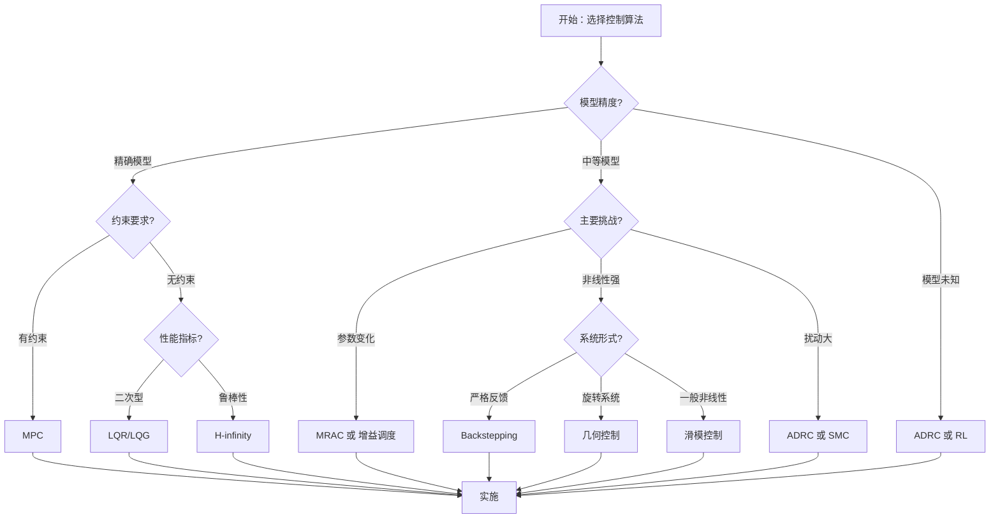
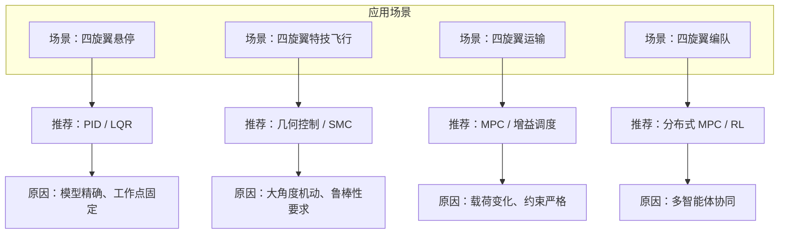
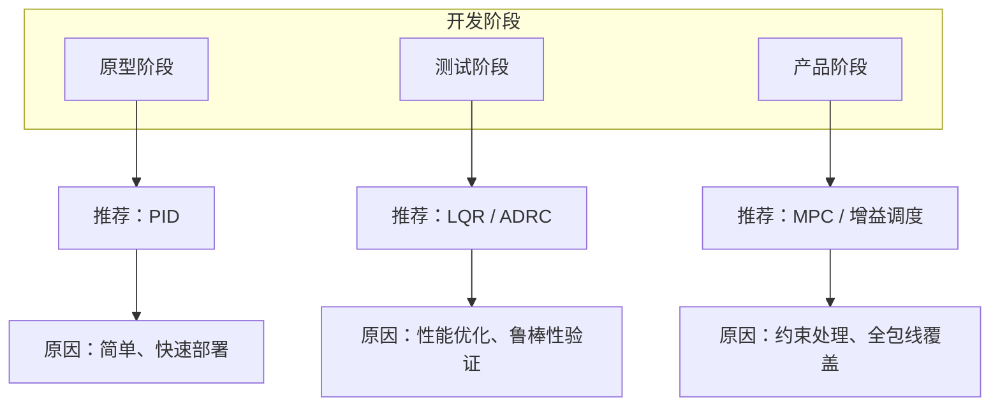
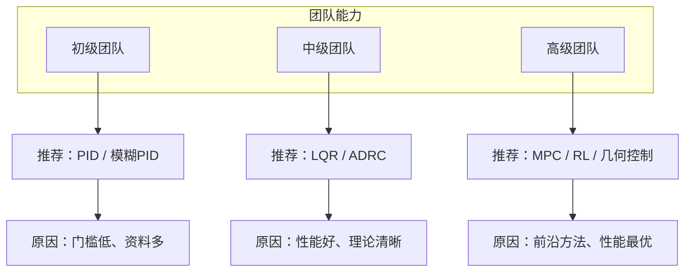
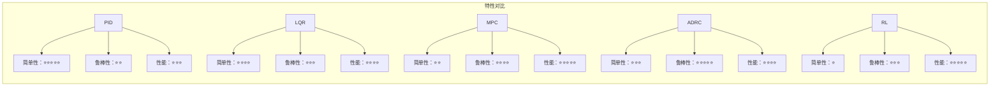
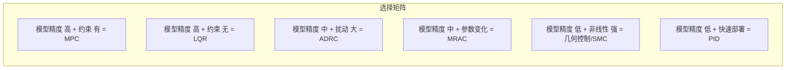

# 算法选择指南

> 本文档使用 Mermaid 语法，可在支持 Mermaid 的 Markdown 查看器中渲染。

---

## 算法选择决策流程

```mermaid
graph TD
    A[开始：选择控制算法] --> B{模型精度?}

    B -->|精确模型| C{约束要求?}
    B -->|中等模型| D{主要挑战?}
    B -->|模型未知| E[ADRC 或 RL]

    C -->|有约束| F[MPC]
    C -->|无约束| G{性能指标?}

    G -->|二次型| H[LQR/LQG]
    G -->|鲁棒性| I[H-infinity]

    D -->|参数变化| J[MRAC 或 增益调度]
    D -->|非线性强| K{系统形式?}
    D -->|扰动大| L[ADRC 或 SMC]

    K -->|严格反馈| M[Backstepping]
    K -->|旋转系统| N[几何控制]
    K -->|一般非线性| O[滑模控制]

    F --> P[实施]
    H --> P
    I --> P
    J --> P
    M --> P
    N --> P
    O --> P
    L --> P
    E --> P
```

---

## 按应用场景选择

```mermaid
graph TD
    subgraph 应用场景
        direction TB
        A[场景：四旋翼悬停]
        B[场景：四旋翼特技飞行]
        C[场景：四旋翼运输]
        D[场景：四旋翼编队]
    end

    A --> A1["推荐：PID / LQR"]
    A1 --> A2["原因：模型精确、工作点固定"]

    B --> B1["推荐：几何控制 / SMC"]
    B1 --> B2["原因：大角度机动、鲁棒性要求"]

    C --> C1["推荐：MPC / 增益调度"]
    C1 --> C2["原因：载荷变化、约束严格"]

    D --> D1["推荐：分布式 MPC / RL"]
    D1 --> D2["原因：多智能体协同"]
```

---

## 按开发阶段选择

```mermaid
graph TD
    subgraph 开发阶段
        direction TB
        A[原型阶段]
        B[测试阶段]
        C[产品阶段]
    end

    A --> A1["推荐：PID"]
    A1 --> A2["原因：简单、快速部署"]

    B --> B1["推荐：LQR / ADRC"]
    B1 --> B2["原因：性能优化、鲁棒性验证"]

    C --> C1["推荐：MPC / 增益调度"]
    C1 --> C2["原因：约束处理、全包线覆盖"]
```

---

## 按团队能力选择

```mermaid
graph TD
    subgraph 团队能力
        direction TB
        A[初级团队]
        B[中级团队]
        C[高级团队]
    end

    A --> A1["推荐：PID / 模糊PID"]
    A1 --> A2["原因：门槛低、资料多"]

    B --> B1["推荐：LQR / ADRC"]
    B1 --> B2["原因：性能好、理论清晰"]

    C --> C1["推荐：MPC / RL / 几何控制"]
    C1 --> C2["原因：前沿方法、性能最优"]
```

---

## 方法特性对比

```mermaid
graph LR
    subgraph 特性对比
        direction TB

        A["PID"]
        A --> A1["简单性：⭐⭐⭐⭐⭐"]
        A --> A2["鲁棒性：⭐⭐"]
        A --> A3["性能：⭐⭐⭐"]

        B["LQR"]
        B --> B1["简单性：⭐⭐⭐⭐"]
        B --> B2["鲁棒性：⭐⭐⭐"]
        B --> B3["性能：⭐⭐⭐⭐"]

        C["MPC"]
        C --> C1["简单性：⭐⭐"]
        C --> C2["鲁棒性：⭐⭐⭐⭐"]
        C --> C3["性能：⭐⭐⭐⭐⭐"]

        D["ADRC"]
        D --> D1["简单性：⭐⭐⭐"]
        D --> D2["鲁棒性：⭐⭐⭐⭐⭐"]
        D --> D3["性能：⭐⭐⭐⭐"]

        E["RL"]
        E --> E1["简单性：⭐"]
        E --> E2["鲁棒性：⭐⭐⭐"]
        E --> E3["性能：⭐⭐⭐⭐⭐"]
    end
```

---

## 综合选择矩阵

```mermaid
graph TD
    subgraph 选择矩阵
        direction TB

        A["模型精度 高 + 约束 有 = MPC"]
        B["模型精度 高 + 约束 无 = LQR"]
        C["模型精度 中 + 扰动 大 = ADRC"]
        D["模型精度 中 + 参数变化 = MRAC"]
        E["模型精度 低 + 非线性 强 = 几何控制/SMC"]
        F["模型精度 低 + 快速部署 = PID"]
    end
```
