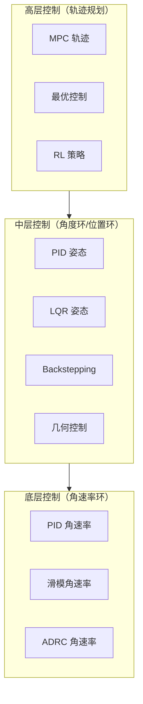
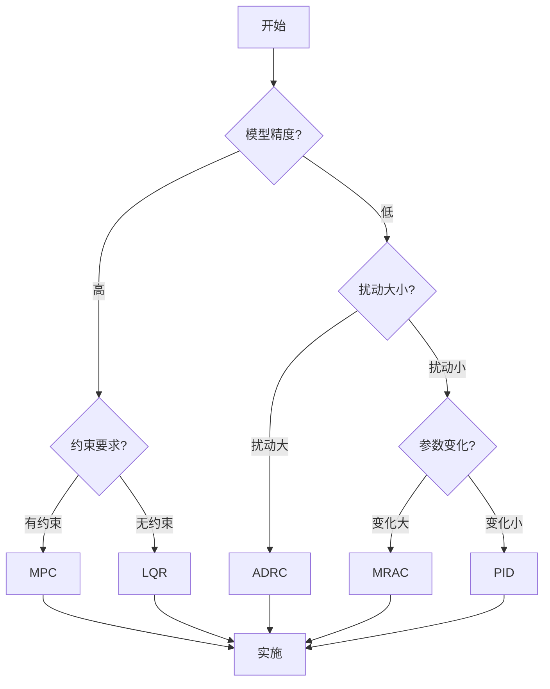

# 控制方法全景树

> 本文档使用 Mermaid 语法，可在支持 Mermaid 的 Markdown 查看器中渲染。

---

## 控制理论知识体系

```mermaid
mindmap
  root((UAV控制理论))
    经典控制基础
      PID控制
        P比例控制
        I积分控制
        D微分控制
        调参方法
          Ziegler-Nichols
          Cohen-Coon
          继电器自整定
      频域分析
        Bode图
        Nyquist判据
        稳定裕度
        超前滞后补偿
      状态空间
        能控性
        能观性
        极点配置
        LQR/LQG
      鲁棒控制
        H-infinity
        mu综合
        结构化不确定性
      级联控制
        内外环设计
        带宽分离
        MIMO解耦
    现代控制方法
      ADRC
        扩张状态观测器
        跟踪微分器
        非线性反馈
      MRAC
        MIT规则
        Lyapunov方法
        自适应律
      MPC
        滚动时域
        约束处理
        Tube MPC
      增益调度
        LPV模型
        插值方法
      最优控制
        Pontryagin原理
        HJB方程
        动态规划
    非线性控制
      Backstepping
        递归设计
        虚拟控制
        自适应反步
      滑模控制
        滑模面设计
        超螺旋算法
        积分滑模
      动态面控制
        低通滤波
        避免项爆炸
      几何控制
        SO(3)控制
        SE(3)跟踪
        四元数方法
      非线性观测器
        ESO
        滑模观测器
        高增益观测器
    自适应与智能控制
      神经网络
        RBF网络
        在线学习
        逼近理论
      模糊控制
        模糊推理
        规则库
        自适应模糊
      强化学习
        策略梯度
        Actor-Critic
        安全RL
      混合方法
        NN+SMC
        Fuzzy+PID
        RL+MPC
```

---

## 按应用层次分类



---

## 方法选择指南


