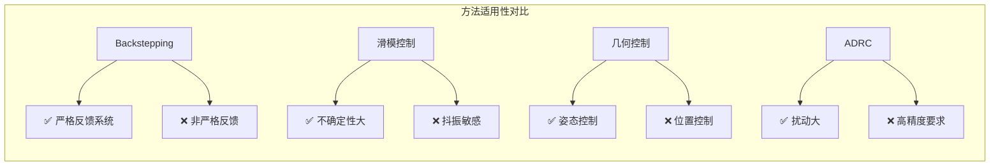
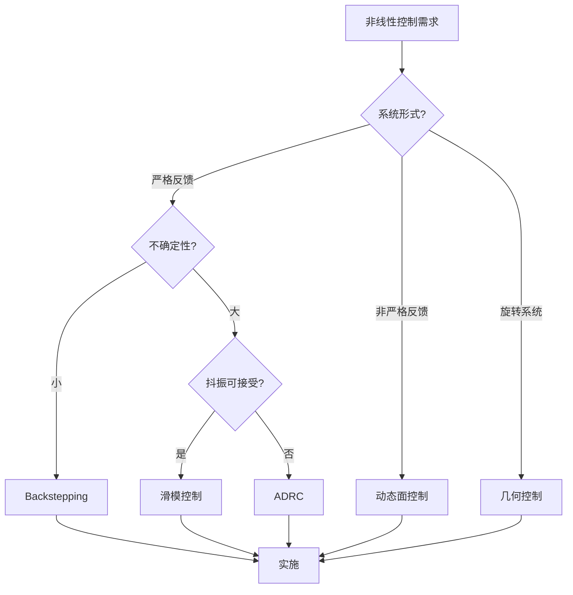
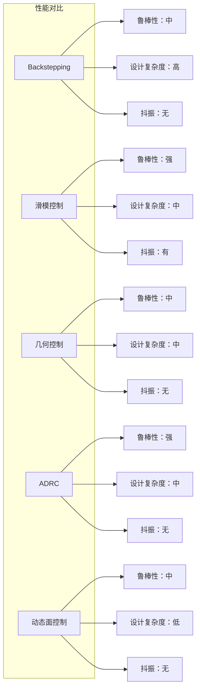
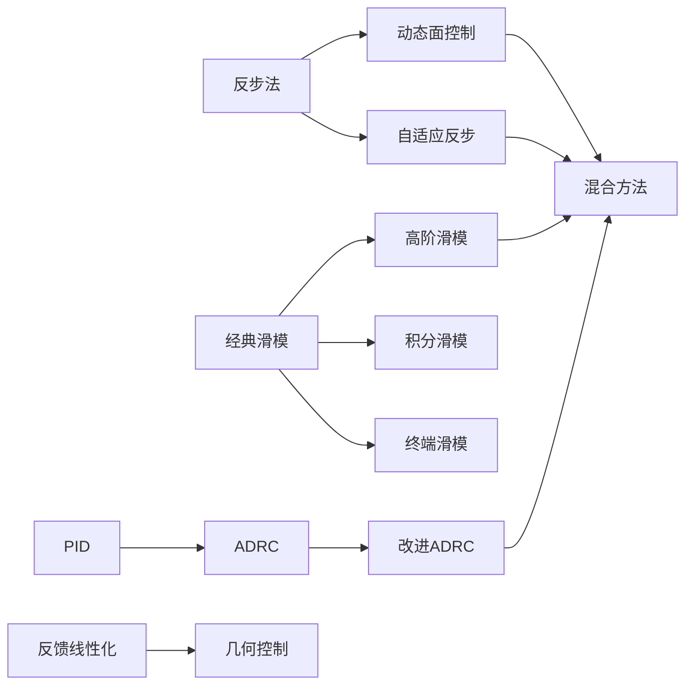

# 非线性控制方法对比

> 本文档使用 Mermaid 语法，可在支持 Mermaid 的 Markdown 查看器中渲染。

---

## 非线性控制方法全景

```mermaid
mindmap
  root((非线性控制))
    几何方法
      反馈线性化
        精确线性化
        输入输出线性化
      Backstepping
        递归设计
        虚拟控制
        自适应反步
      几何控制
        SO(3)控制
        SE(3)跟踪
    滑模方法
      经典滑模
        切换控制
        等效控制
      高阶滑模
        超螺旋算法
        积分滑模
      终端滑模
        有限时间收敛
        非线性滑模面
    自适应方法
      MRAC
        MIT规则
        Lyapunov方法
      NN自适应
        RBF网络
        在线学习
      模糊自适应
        规则调整
        参数自适应
    观测器方法
      ESO
        扩张状态观测
        扰动估计
      滑模观测器
        鲁棒估计
        故障检测
      高增益观测器
        快速收敛
        噪声敏感
    混合方法
      NN+SMC
        逼近+鲁棒
      ADRC+SMC
        抗扰+鲁棒
      RL+MPC
        学习+约束
```

---

## 方法对比表



---

## 非线性控制选择决策树



---

## 性能对比雷达图



---

## 方法演进关系


