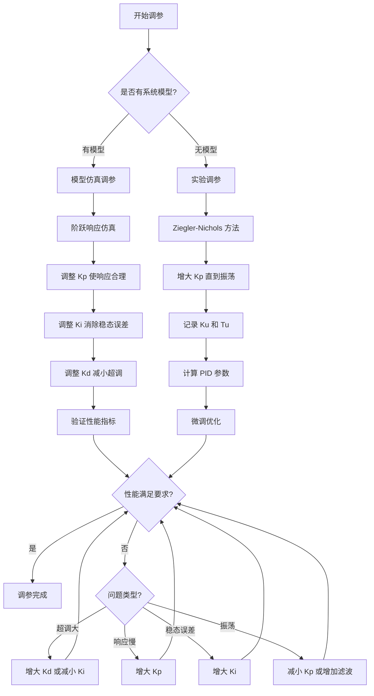
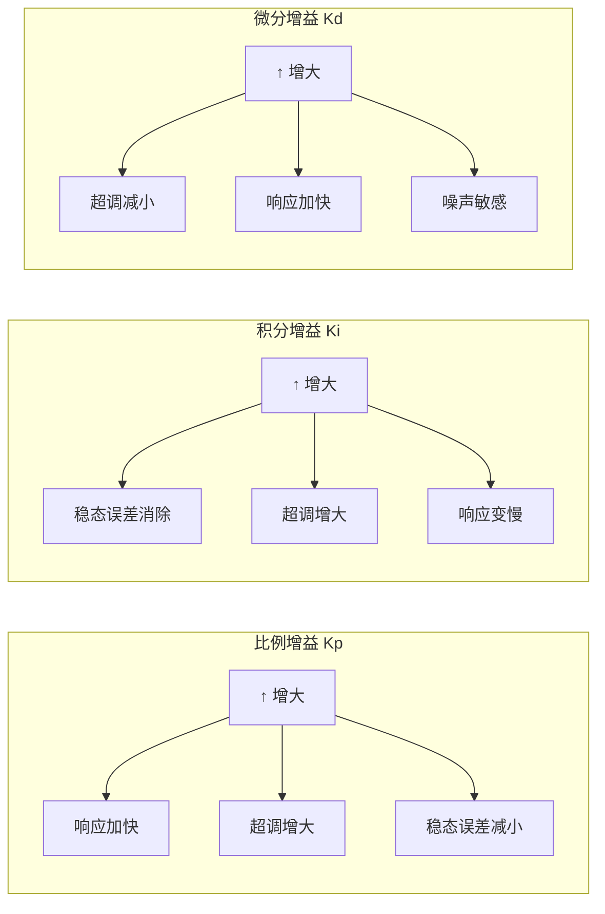
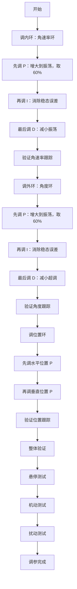
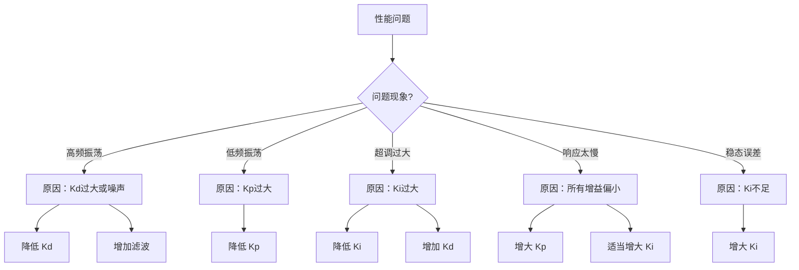

# PID 调参决策流程

> 本文档使用 Mermaid 语法，可在支持 Mermaid 的 Markdown 查看器中渲染。

---

## PID 调参决策流程图

```mermaid
graph TD
    A[开始调参] --> B{是否有系统模型?}

    B -->|有模型| C[模型仿真调参]
    B -->|无模型| D[实验调参]

    C --> C1[阶跃响应仿真]
    C1 --> C2[调整 Kp 使响应合理]
    C2 --> C3[调整 Ki 消除稳态误差]
    C3 --> C4[调整 Kd 减小超调]
    C4 --> C5[验证性能指标]

    D --> D1[Ziegler-Nichols 方法]
    D1 --> D2[增大 Kp 直到振荡]
    D2 --> D3[记录 Ku 和 Tu]
    D3 --> D4[计算 PID 参数]
    D4 --> D5[微调优化]

    C5 --> E{性能满足要求?}
    D5 --> E

    E -->|是| F[调参完成]
    E -->|否| G{问题类型?}

    G -->|超调大| H[增大 Kd 或减小 Ki]
    G -->|响应慢| I[增大 Kp]
    G -->|稳态误差| J[增大 Ki]
    G -->|振荡| K[减小 Kp 或增加滤波]

    H --> E
    I --> E
    J --> E
    K --> E
```

---

## PID 参数影响速查表

```mermaid
graph LR
    subgraph Kp["比例增益 Kp"]
        Kp_up["↑ 增大"] --> Kp_effect1["响应加快"]
        Kp_up --> Kp_effect2["超调增大"]
        Kp_up --> Kp_effect3["稳态误差减小"]
    end

    subgraph Ki["积分增益 Ki"]
        Ki_up["↑ 增大"] --> Ki_effect1["稳态误差消除"]
        Ki_up --> Ki_effect2["超调增大"]
        Ki_up --> Ki_effect3["响应变慢"]
    end

    subgraph Kd["微分增益 Kd"]
        Kd_up["↑ 增大"] --> Kd_effect1["超调减小"]
        Kd_up --> Kd_effect2["响应加快"]
        Kd_up --> Kd_effect3["噪声敏感"]
    end
```

---

## 无人机 PID 调参顺序

```mermaid
graph TD
    A[开始] --> B[调内环：角速率环]
    B --> B1[先调 P：增大到振荡，取 60%]
    B1 --> B2[再调 I：消除稳态误差]
    B2 --> B3[最后调 D：减小振荡]
    B3 --> B4[验证角速率跟踪]

    B4 --> C[调外环：角度环]
    C --> C1[先调 P：增大到振荡，取 60%]
    C1 --> C2[再调 I：消除稳态误差]
    C2 --> C3[最后调 D：减小超调]
    C3 --> C4[验证角度跟踪]

    C4 --> D[调位置环]
    D --> D1[先调水平位置 P]
    D1 --> D2[再调垂直位置 P]
    D2 --> D3[验证位置跟踪]

    D3 --> E[整体验证]
    E --> E1[悬停测试]
    E1 --> E2[机动测试]
    E2 --> E3[扰动测试]
    E3 --> F[调参完成]
```

---

## 常见问题诊断

```mermaid
graph TD
    A[性能问题] --> B{问题现象?}

    B -->|高频振荡| C[原因：Kd过大或噪声]
    C --> C1[降低 Kd]
    C --> C2[增加滤波]

    B -->|低频振荡| D[原因：Kp过大]
    D --> D1[降低 Kp]

    B -->|超调过大| E[原因：Ki过大]
    E --> E1[降低 Ki]
    E --> E2[增加 Kd]

    B -->|响应太慢| F[原因：所有增益偏小]
    F --> F1[增大 Kp]
    F --> F2[适当增大 Ki]

    B -->|稳态误差| G[原因：Ki不足]
    G --> G1[增大 Ki]
```
